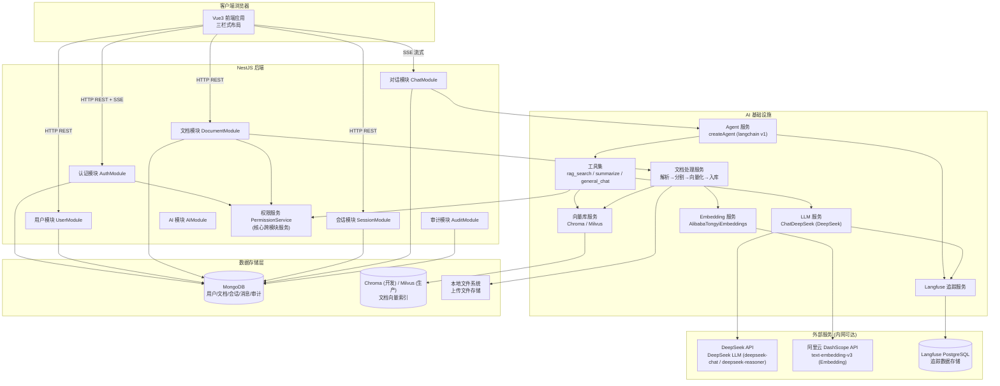
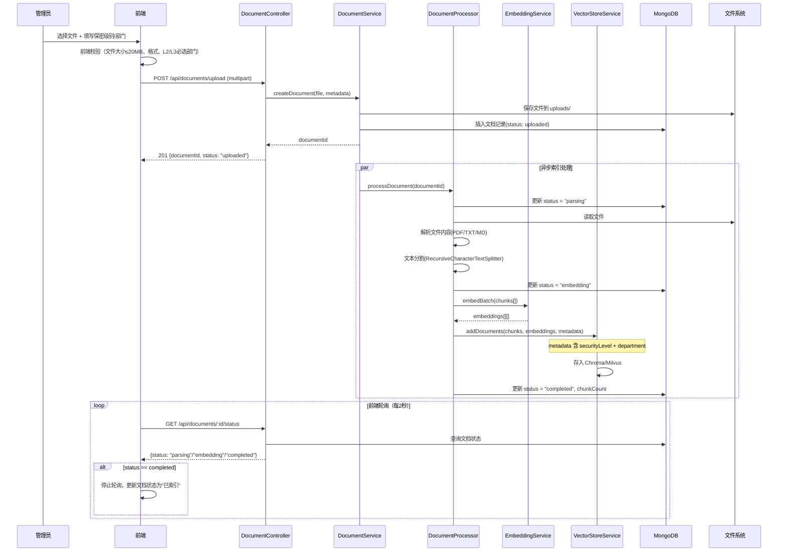
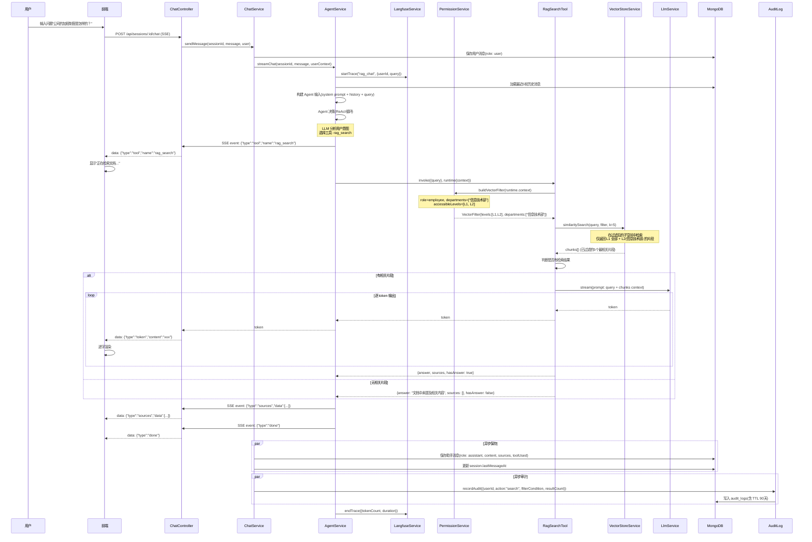
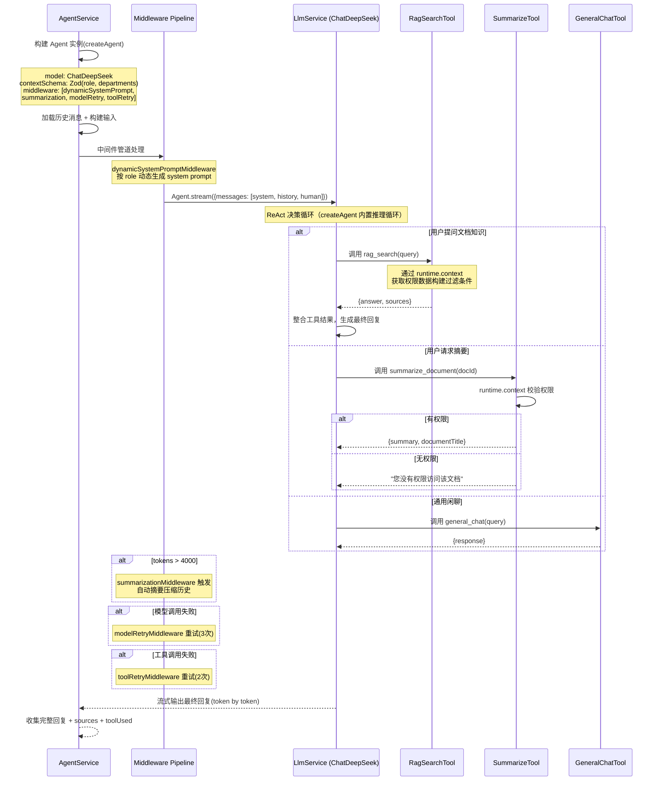
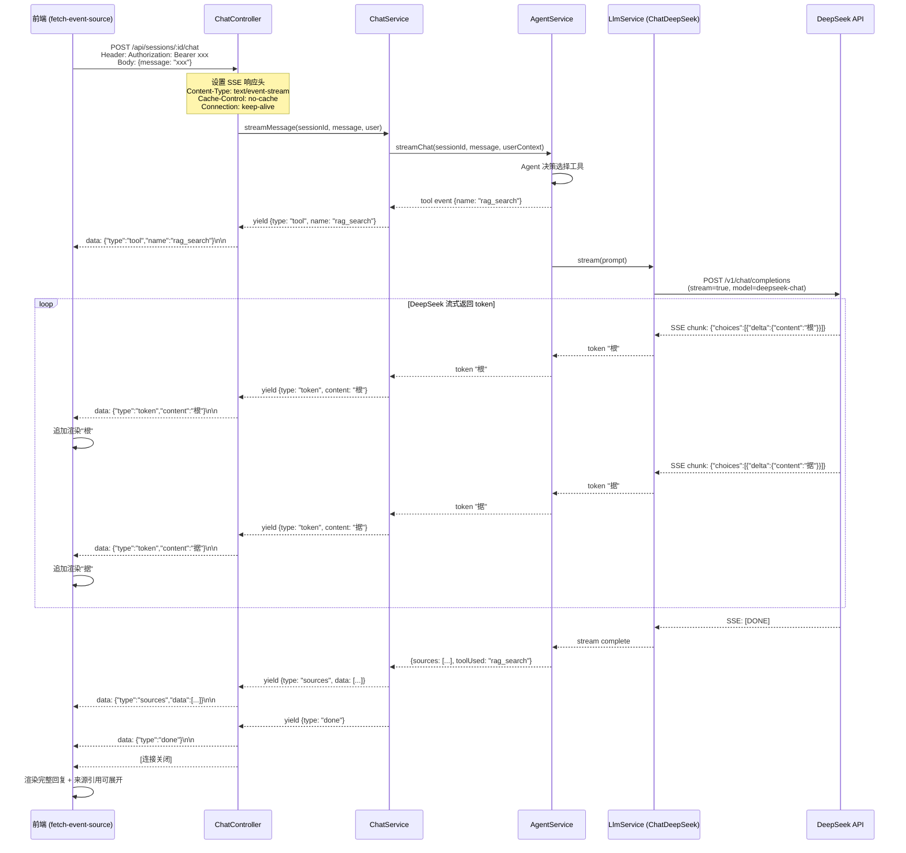
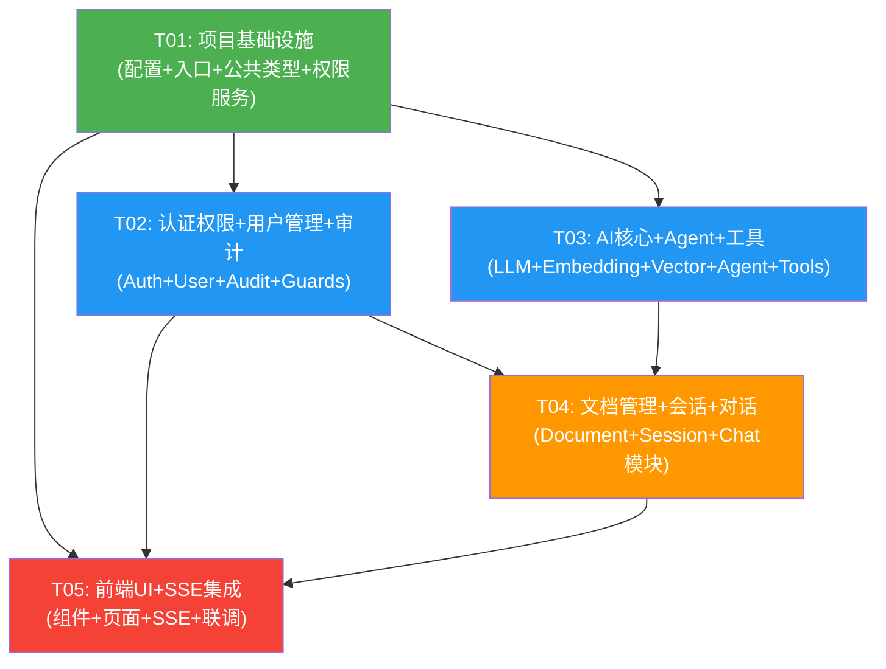

# 智能文档助手 — 系统架构设计文档

> **文档状态**：✅ 架构设计完成  
> **编写人**：架构师 高见远（Bob）  
> **基于文档**：PRD.md v1 + PRD-increment.md v2（已定稿）  
> **冲突处理**：以 PRD-increment.md v2 为准  

---

## 目录

1. [实现方案与框架选型](#1-实现方案与框架选型)
2. [文件列表及相对路径](#2-文件列表及相对路径)
3. [数据结构和接口](#3-数据结构和接口)
4. [程序调用流程](#4-程序调用流程)
5. [任务列表](#5-任务列表)
6. [依赖包列表](#6-依赖包列表)
7. [共享知识（跨文件约定）](#7-共享知识跨文件约定)
8. [待明确事项](#8-待明确事项)

---

## 1. 实现方案与框架选型

### 1.1 整体架构图



### 1.2 前后端分离方案

| 维度 | 前端 | 后端 |
|------|------|------|
| **技术栈** | Vue 3 + TypeScript + Vite | NestJS + TypeScript |
| **状态管理** | Pinia（轻量、TypeScript 友好） | — |
| **样式** | Tailwind CSS（原子化 CSS） | — |
| **HTTP 通信** | Axios（REST API）+ EventSource（SSE 流式） | NestJS 控制器（REST + SSE） |
| **端口** | 5173（开发） / 80（Docker Nginx） | 3000 |
| **构建产物** | 静态文件（Nginx 托管） | Node.js 进程 |

**通信协议设计**：
- **常规接口**：RESTful JSON，统一响应格式 `{ code: number, data: T, message: string }`
- **流式问答**：SSE（Server-Sent Events），后端通过 NestJS `@Sse()` 装饰器返回 `Observable<MessageEvent>`
- **认证**：前端在 Axios 请求头携带 `Authorization: Bearer <JWT>`；SSE 通过 URL query 参数传递 token（EventSource 不支持自定义 Header）

### 1.3 Agent 架构设计（LangChain v1 createAgent 在 NestJS 中的落地方案）

#### 选型依据

PRD 倾向使用 LangChain.js 的 `createAgent` 架构。LangChain v1 推荐使用 `langchain` 包中的 `createAgent` 函数（`createReactAgent` 已在 v1 中弃用）。该架构让 LLM 自主决定调用哪个工具，并通过中间件系统实现动态系统提示词、摘要压缩、重试等横切关注点，非常适合需要灵活扩展的企业应用。

#### 架构设计

```
用户消息 + 历史上下文
        ↓
┌──────────────────────────────────────┐
│   createAgent (langchain v1)          │
│                                       │
│   LLM: ChatDeepSeek (DeepSeek)         │
│   contextSchema: Zod (权限上下文)      │
│   (会话持久化内置)                       │
│                                       │
│   ┌──────────────────────────────┐    │
│   │  Middleware Pipeline          │    │
│   │  1. dynamicSystemPromptMW     │    │
│   │     (按角色动态生成提示词)      │    │
│   │  2. summarizationMW           │    │
│   │     (超 4000 tokens 自动压缩)  │    │
│   │  3. modelRetryMW (maxRetries) │    │
│   │  4. toolRetryMW (maxRetries)  │    │
│   └──────────┬───────────────────┘    │
│              ↓                         │
│   ┌──────────────────────────────┐    │
│   │    Agent 决策循环             │    │
│   │  (LLM 思考→工具调用→观察)     │    │
│   └──────────┬───────────────────┘    │
│              ↓                         │
│   ┌──────────────────────────────┐    │
│   │      工具集 (Tools)           │    │
│   │  ┌────────────────────────┐  │    │
│   │  │ rag_search             │  │    │
│   │  │ summarize_document     │  │    │
│   │  │ general_chat           │  │    │
│   │  └────────────────────────┘  │    │
│   │  (工具通过 runtime.context   │    │
│   │   访问权限数据)              │    │
│   └──────────────────────────────┘    │
└───────────────────────────────────────┘
        ↓
流式输出 (token by token)
```

#### NestJS 集成方案

Agent 服务作为 NestJS 的 `@Injectable()` Provider，在模块初始化时构建 Agent 实例：

1. **Agent 构建**：在 `AgentService` 的 `onModuleInit()` 生命周期中，调用 `createAgent()` 构建 Agent。导入路径为 `import { createAgent } from "langchain"`。LLM 使用 `ChatDeepSeek`（来自 `@langchain/deepseek`），工具以 LangChain Tool 对象形式注册。**注意**：必须将 model 和 tools 分开传递给 `createAgent`，不能先 `bindTools` 再传给 `createAgent`（v1 不再支持 Pre-bound Models）。

2. **权限上下文传递**：用户角色和部门信息通过 `contextSchema`（Zod schema）定义结构，调用时通过 `context` 参数传递。`thread_id`（管理对话历史/检查点）仍通过 `configurable` 传递。两者并行不冲突。每个工具在执行时通过第二个参数 `runtime` 的 `runtime.context` 读取用户上下文，构建权限过滤条件。

3. **中间件系统**：`createAgent` 通过 `middleware` 参数配置中间件管道，实现动态系统提示词、对话摘要压缩、模型/工具重试等横切关注点。所有中间件均从 `langchain` 包导入。

4. **流式输出**：使用 Agent 的 `.stream()` 方法获取异步迭代器，逐 token 推送给 SSE 控制器。流式事件中的节点名为 `"model"`。

5. **多轮对话记忆**：从 MongoDB 加载最近 5 轮（10 条消息）历史记录，拼接到 Agent 输入中。`createAgent` 内置会话持久化（基于 LangGraph），无需额外配置 checkpointer。

#### 工具权限隔离

每个工具在执行前都会校验用户权限：

| 工具 | 权限校验 |
|------|---------|
| `rag_search` | 使用用户 role + departments 构建向量库过滤条件（Pre-filtering） |
| `summarize_document` | 校验用户是否有该文档的访问权限（通过 PermissionService） |
| `general_chat` | 无权限限制（通用闲聊兜底） |

#### 中间件架构（核心扩展机制）

`createAgent` 通过中间件管道实现横切关注点，所有中间件均从 `langchain` 包导入：

```typescript
import {
  createAgent,
  summarizationMiddleware,
  dynamicSystemPromptMiddleware,
  modelRetryMiddleware,
  toolRetryMiddleware,
  tool,
} from "langchain";
import * as z from "zod";

// 1. 用 Zod 定义权限上下文结构
const contextSchema = z.object({
  role: z.enum(["employee", "manager", "ceo", "admin"]),
  departments: z.array(z.string()),
  userId: z.string(),
});

// 2. 创建 Agent，配置中间件管道
const agent = createAgent({
  model: deepSeekModel,       // ChatDeepSeek 实例（@langchain/deepseek）
  tools: [ragSearch, summarizeDocument, generalChat],
  contextSchema,              // 权限上下文 Schema
  middleware: [
    // 按角色动态生成 System Prompt
    dynamicSystemPromptMiddleware((state, runtime) => {
      const { role } = runtime.context;
      return buildSystemPrompt(role);
    }),
    // 对话超过 4000 tokens 时自动摘要压缩历史
    summarizationMiddleware({
      model: deepSeekModel,
      trigger: { tokens: 4000 },
    }),
    // 模型调用失败时自动重试
    modelRetryMiddleware({ maxRetries: 3 }),
    // 工具调用失败时自动重试
    toolRetryMiddleware({ maxRetries: 2 }),
  ],
});

// 3. 调用时：thread_id 走 configurable，权限数据走 context
await agent.invoke(
  { messages: [...] },
  {
    configurable: { thread_id: sessionId },
    context: { role: "employee", departments: ["信息技术部"], userId: "123" },
  }
);
```

**中间件说明**：

| 中间件 | 导入来源 | 作用 |
|--------|---------|------|
| `dynamicSystemPromptMiddleware` | `langchain` | 根据运行时上下文（如用户角色）动态生成 System Prompt |
| `summarizationMiddleware` | `langchain` | 对话历史超过阈值时自动摘要压缩，控制 token 消耗 |
| `modelRetryMiddleware` | `langchain` | LLM 调用失败时自动重试 |
| `toolRetryMiddleware` | `langchain` | 工具调用失败时自动重试 |

### 1.4 DeepSeek LLM 接入方案 + 通义千问 Embedding 接入方案

本系统的 AI 能力分为两个独立的外部 API 调用：
- **LLM（文本生成）**：使用 **DeepSeek API**（通过官方 `@langchain/deepseek` 包调用）
- **Embedding（向量化）**：使用 **阿里云 DashScope API**（通义千问 text-embedding-v3）

#### LLM 接入（DeepSeek API via @langchain/deepseek）

使用 DeepSeek 官方 LangChain 集成包 `@langchain/deepseek` 中的 `ChatDeepSeek` 类：

```typescript
import { ChatDeepSeek } from "@langchain/deepseek";

const llm = new ChatDeepSeek({
  model: "deepseek-chat",  // 默认模型
  temperature: 0,
});
```

| 配置项 | 值 |
|--------|-----|
| 模型 | `deepseek-chat`（默认，支持 tool calling）/ `deepseek-reasoner`（纯推理，不支持工具调用） |
| API Key | 从环境变量 `DEEPSEEK_API_KEY` 读取 |
| 流式 | 默认支持 token-by-token 输出 |
| 温度 | 0（Agent 场景推荐，提高工具调用准确性） |

**模型选择说明**：

| 模型 | 支持工具调用 | 流式输出 | 结构化输出 | 用途 |
|------|:----------:|:--------:|:----------:|------|
| `deepseek-chat` | ✅ | ✅ | ✅ | Agent 主模型（工具调用、日常问答、摘要） |
| `deepseek-reasoner` | ❌（截至 2025/01/27） | ✅ | ❌ | 可选备用推理模型（非 Agent 场景） |

**与 createAgent 的集成**：Agent 主模型必须使用 `deepseek-chat`（因 `createAgent` 依赖工具调用能力）。`deepseek-reasoner` 可保留作为可选的备用推理模型，用于非 Agent 场景（如单独调用摘要生成）。

在代码中通过 `LlmService` 封装，提供 `chat()` 和 `stream()` 两个核心方法：

```typescript
import { ChatDeepSeek } from "@langchain/deepseek";

export class LlmService {
  private model: ChatDeepSeek;

  constructor() {
    this.model = new ChatDeepSeek({
      model: process.env.LLM_MODEL || "deepseek-chat",
      temperature: 0,
    });
  }

  getModel(): ChatDeepSeek {
    return this.model;
  }

  async chat(messages: BaseMessage[]): Promise<string> {
    const result = await this.model.invoke(messages);
    return result.content as string;
  }

  async stream(messages: BaseMessage[], onToken: (token: string) => void): Promise<string> {
    const stream = await this.model.stream(messages);
    let fullContent = "";
    for await (const chunk of stream) {
      const content = chunk.content as string;
      if (content) {
        fullContent += content;
        onToken(content);
      }
    }
    return fullContent;
  }
}
```

#### Embedding 接入（通义千问 via DashScope API）

Embedding 使用 `@langchain/community` 包中的 `AlibabaTongyiEmbeddings` 类：

| 配置项 | 值 |
|--------|-----|
| 模型 | `text-embedding-v3` |
| 维度 | 1024（通义千问 Embedding 默认维度） |
| API Key | 从环境变量 `DASHSCOPE_API_KEY` 读取 |

在代码中通过 `EmbeddingService` 封装，提供 `embedText()` 和 `embedBatch()` 方法。

#### ⚠️ 内网部署说明

PRD 要求"数据不出内网"，但本系统需要调用两个外部云 API：
1. **DeepSeek API**（LLM 文本生成）
2. **阿里云 DashScope API**（Embedding 向量化）

**假设**：企业内网可通过专线/VPN/白名单同时访问 DeepSeek API 和 DashScope API。

**替代方案**（若需完全物理隔离）：
- LLM：在内网部署 DeepSeek 开源模型（DeepSeek-V3 / DeepSeek-R1，通过 vLLM 或 Ollama 提供 OpenAI 兼容 API），将 `ChatDeepSeek` 替换为本地 endpoint
- Embedding：在内网部署通义千问 Embedding 开源模型或 BGE 模型，替换 `AlibabaTongyiEmbeddings` 为本地 Embedding 服务
- 架构设计已预留此切换路径（通过 `LlmService` 和 `EmbeddingService` 封装，对外接口不变）

详见 [第 8 节 待明确事项](#8-待明确事项)。

### 1.5 Langfuse 集成方案

#### 部署方案

Langfuse 开源版通过 Docker Compose 部署，包含以下服务：
- **Langfuse Web**：Web 界面 + API 服务
- **PostgreSQL**：追踪数据存储

#### 集成方式

使用 `langfuse` npm 包的 `CallbackHandler`，作为 LangChain.js 的回调处理器：

1. 在 `LangfuseService` 中初始化 `LangfuseCallbackHandler`，配置 `publicKey`、`secretKey`、`baseUrl`（指向内网 Langfuse 实例）。
2. 将 CallbackHandler 传入 `ChatDeepSeek` 的 `callbacks` 参数和 `createAgent` 的执行配置中（通过 `agent.invoke()` / `agent.stream()` 的 `callbacks` 选项传递）。
3. LangChain.js 的所有 LLM 调用、工具执行、检索操作自动上报到 Langfuse，形成完整 trace 链路。
4. 在 Langfuse Web 界面可查看每次问答的完整链路：用户输入 → Agent 决策（含中间件处理）→ 工具调用 → 向量检索 → LLM 生成 → 最终回复。

#### 追踪范围

| 追踪节点 | 记录内容 |
|---------|---------|
| Agent 决策 | 选择的工具名称、决策推理过程 |
| RAG 检索 | 查询语句、过滤条件、返回的 chunks 数量 |
| LLM 生成 | prompt 内容（脱敏）、token 用量、响应延迟 |
| 工具执行 | 工具名称、输入参数、输出结果、执行耗时 |

### 1.6 SSE 流式输出方案

#### 后端实现

NestJS 原生支持 SSE，使用 `@Sse()` 装饰器返回 `Observable<MessageEvent>`：

```
用户请求 POST /api/sessions/:id/chat
    ↓
ChatController 接收请求，创建 SSE Observable
    ↓
AgentService.streamChat() 启动 Agent 流式执行
    ↓
Agent 内部 LLM 逐 token 输出
    ↓
每个 token 通过 SSE 事件推送到前端:
    data: {"type":"token","content":"你"}
    data: {"type":"token","content":"好"}
    ↓
工具执行完毕后推送来源引用:
    data: {"type":"sources","data":[{...}]}
    ↓
最终推送完成事件:
    data: {"type":"done"}
```

#### SSE 事件类型设计

| 事件类型 | data 内容 | 说明 |
|---------|----------|------|
| `token` | `{"type":"token","content":"xxx"}` | 逐 token 文本片段 |
| `sources` | `{"type":"sources","data":[{documentId, title, chunk, page}]}` | 来源引用列表 |
| `tool` | `{"type":"tool","name":"rag_search"}` | Agent 选择的工具（用于 UI 显示"正在检索文档..."） |
| `error` | `{"type":"error","message":"xxx"}` | 错误信息 |
| `done` | `{"type":"done"}` | 流结束标记 |

#### 前端实现

使用浏览器原生 `EventSource` API 或 `@microsoft/fetch-event-source` 库（支持 POST 请求 + 自定义 Header）。由于需要 POST 请求体和认证 Header，推荐使用 `@microsoft/fetch-event-source`。

---

## 2. 文件列表及相对路径

### 2.1 项目根目录结构

```
doc-assistant/
├── docker-compose.yml                    # Docker Compose 编排（全部服务）
├── .env.example                          # 环境变量模板
├── README.md                             # 项目说明
│
├── frontend/                             # 前端项目
│   ├── package.json
│   ├── vite.config.ts
│   ├── tsconfig.json
│   ├── tsconfig.node.json
│   ├── tailwind.config.ts
│   ├── postcss.config.js
│   ├── index.html
│   ├── Dockerfile
│   ├── nginx.conf                        # Nginx 配置（Docker 部署用）
│   └── src/
│       ├── main.ts                       # 应用入口
│       ├── App.vue                       # 根组件
│       ├── router/
│       │   └── index.ts                  # 路由配置（含路由守卫）
│       ├── stores/
│       │   ├── auth.ts                   # 认证状态（登录/JWT/用户信息）
│       │   ├── session.ts                # 会话状态（会话列表/当前会话）
│       │   └── document.ts              # 文档状态（文档列表/上传状态）
│       ├── types/
│       │   └── index.ts                  # 前端类型定义
│       ├── api/
│       │   ├── client.ts                 # Axios 实例（拦截器/错误处理）
│       │   ├── auth.ts                   # 认证 API
│       │   ├── user.ts                   # 用户管理 API
│       │   ├── document.ts               # 文档 API
│       │   ├── session.ts                # 会话 API
│       │   └── chat.ts                   # 对话 API（含 SSE）
│       ├── composables/
│       │   ├── useAuth.ts                # 认证组合式函数
│       │   ├── useSSE.ts                 # SSE 流式通信组合式函数
│       │   └── useChat.ts                # 对话逻辑组合式函数
│       ├── components/
│       │   ├── layout/
│       │   │   └── AppLayout.vue         # 三栏式主布局
│       │   ├── chat/
│       │   │   ├── ChatPanel.vue         # 对话区域（消息流+输入框）
│       │   │   ├── MessageBubble.vue     # 消息气泡（用户/助手）
│       │   │   ├── SourceReferences.vue  # 来源引用展开组件
│       │   │   └── ChatInput.vue         # 输入框+发送按钮
│       │   ├── session/
│       │   │   ├── SessionList.vue       # 会话列表
│       │   │   └── SessionItem.vue       # 会话列表项
│       │   └── document/
│       │       ├── DocumentUpload.vue    # 文档上传（拖拽+保密标注）
│       │       ├── DocumentList.vue       # 文档列表（含状态徽章）
│       │       └── DocumentProgress.vue   # 索引进度展示
│       ├── views/
│       │   ├── LoginView.vue             # 登录页
│       │   ├── ChatView.vue              # 主对话页（三栏布局）
│       │   └── AdminView.vue             # 管理后台（用户管理+文档管理）
│       └── styles/
│           └── main.css                  # 全局样式（Tailwind 指令）
│
├── backend/                              # 后端项目
│   ├── package.json
│   ├── tsconfig.json
│   ├── tsconfig.build.json
│   ├── nest-cli.json
│   ├── Dockerfile
│   └── src/
│       ├── main.ts                       # 应用入口（启动 NestJS）
│       ├── app.module.ts                 # 根模块
│       ├── config/
│       │   ├── configuration.ts          # 配置加载器
│       │   └── env.validation.ts         # 环境变量校验
│       ├── common/                       # 公共模块
│       │   ├── types/
│       │   │   ├── express.d.ts          # Express 类型扩展（Request.user）
│       │   │   └── common.types.ts       # 公共类型（UserContext, SecurityLevel, Role 等）
│       │   ├── decorators/
│       │   │   ├── current-user.decorator.ts  # @CurrentUser() 装饰器
│       │   │   └── roles.decorator.ts         # @Roles() 装饰器
│       │   ├── guards/
│       │   │   ├── jwt-auth.guard.ts     # JWT 认证守卫
│       │   │   └── roles.guard.ts        # 角色权限守卫
│       │   ├── filters/
│       │   │   └── http-exception.filter.ts  # 全局异常过滤器
│       │   └── interceptors/
│       │       └── transform.interceptor.ts  # 统一响应格式拦截器
│       ├── database/
│       │   └── database.module.ts        # MongoDB 连接模块
│       ├── modules/
│       │   ├── auth/                     # 认证模块
│       │   │   ├── auth.module.ts
│       │   │   ├── auth.controller.ts
│       │   │   ├── auth.service.ts
│       │   │   ├── jwt.strategy.ts
│       │   │   └── dto/
│       │   │       └── login.dto.ts
│       │   ├── user/                     # 用户模块
│       │   │   ├── user.module.ts
│       │   │   ├── user.controller.ts
│       │   │   ├── user.service.ts
│       │   │   ├── user.schema.ts        # Mongoose Schema
│       │   │   └── dto/
│       │   │       └── user.dto.ts
│       │   ├── document/                 # 文档模块
│       │   │   ├── document.module.ts
│       │   │   ├── document.controller.ts
│       │   │   ├── document.service.ts
│       │   │   ├── document.schema.ts
│       │   │   └── dto/
│       │   │       └── document.dto.ts
│       │   ├── session/                  # 会话模块
│       │   │   ├── session.module.ts
│       │   │   ├── session.controller.ts
│       │   │   ├── session.service.ts
│       │   │   ├── session.schema.ts
│       │   │   └── dto/
│       │   │       └── session.dto.ts
│       │   ├── chat/                     # 对话模块
│       │   │   ├── chat.module.ts
│       │   │   ├── chat.controller.ts
│       │   │   ├── chat.service.ts
│       │   │   └── message.schema.ts
│       │   ├── audit/                    # 审计模块
│       │   │   ├── audit.module.ts
│       │   │   ├── audit.service.ts
│       │   │   └── audit.schema.ts
│       │   └── ai/                       # AI 模块（核心）
│       │       ├── ai.module.ts
│       │       ├── llm.service.ts        # LLM 服务（ChatDeepSeek 封装，@langchain/deepseek）
│       │       ├── embedding.service.ts  # Embedding 服务
│       │       ├── vector-store.service.ts  # 向量库服务（Chroma/Milvus 抽象）
│       │       ├── document-processor.service.ts  # 文档处理流水线
│       │       ├── permission.service.ts  # 权限服务（核心跨模块服务）
│       │       ├── agent.service.ts      # Agent 服务（createAgent）
│       │       ├── langfuse.service.ts   # Langfuse 追踪服务
│       │       └── tools/
│       │           ├── rag-search.tool.ts       # RAG 检索工具
│       │           ├── summarize.tool.ts        # 文档摘要工具
│       │           └── general-chat.tool.ts     # 通用闲聊工具
│       └── scripts/
│           └── seed.ts                   # 数据库初始化脚本（创建管理员账号）
│
└── infra/                                # 基础设施配置
    └── langfuse/
        └── docker-compose.langfuse.yml   # Langfuse 独立编排（含 PostgreSQL）
```

### 2.2 文件清单汇总表

| 序号 | 模块 | 文件路径 | 说明 |
|------|------|---------|------|
| 1 | 根目录 | `docker-compose.yml` | 全部服务编排 |
| 2 | 根目录 | `.env.example` | 环境变量模板 |
| 3 | 前端-配置 | `frontend/package.json` | 依赖声明 |
| 4 | 前端-配置 | `frontend/vite.config.ts` | Vite 构建配置 |
| 5 | 前端-配置 | `frontend/tsconfig.json` | TypeScript 配置 |
| 6 | 前端-配置 | `frontend/tailwind.config.ts` | Tailwind 配置 |
| 7 | 前端-配置 | `frontend/postcss.config.js` | PostCSS 配置 |
| 8 | 前端-配置 | `frontend/index.html` | HTML 入口 |
| 9 | 前端-配置 | `frontend/Dockerfile` | 前端容器构建 |
| 10 | 前端-配置 | `frontend/nginx.conf` | Nginx 反向代理配置 |
| 11 | 前端-入口 | `frontend/src/main.ts` | Vue 应用入口 |
| 12 | 前端-入口 | `frontend/src/App.vue` | 根组件 |
| 13 | 前端-路由 | `frontend/src/router/index.ts` | 路由+守卫 |
| 14 | 前端-状态 | `frontend/src/stores/auth.ts` | 认证 Store |
| 15 | 前端-状态 | `frontend/src/stores/session.ts` | 会话 Store |
| 16 | 前端-状态 | `frontend/src/stores/document.ts` | 文档 Store |
| 17 | 前端-类型 | `frontend/src/types/index.ts` | 前端类型定义 |
| 18 | 前端-API | `frontend/src/api/client.ts` | Axios 实例 |
| 19 | 前端-API | `frontend/src/api/auth.ts` | 认证 API |
| 20 | 前端-API | `frontend/src/api/user.ts` | 用户 API |
| 21 | 前端-API | `frontend/src/api/document.ts` | 文档 API |
| 22 | 前端-API | `frontend/src/api/session.ts` | 会话 API |
| 23 | 前端-API | `frontend/src/api/chat.ts` | 对话 API (SSE) |
| 24 | 前端-组合式 | `frontend/src/composables/useAuth.ts` | 认证组合式 |
| 25 | 前端-组合式 | `frontend/src/composables/useSSE.ts` | SSE 通信 |
| 26 | 前端-组合式 | `frontend/src/composables/useChat.ts` | 对话逻辑 |
| 27 | 前端-组件 | `frontend/src/components/layout/AppLayout.vue` | 三栏布局 |
| 28 | 前端-组件 | `frontend/src/components/chat/ChatPanel.vue` | 对话区域 |
| 29 | 前端-组件 | `frontend/src/components/chat/MessageBubble.vue` | 消息气泡 |
| 30 | 前端-组件 | `frontend/src/components/chat/SourceReferences.vue` | 来源引用 |
| 31 | 前端-组件 | `frontend/src/components/chat/ChatInput.vue` | 输入框 |
| 32 | 前端-组件 | `frontend/src/components/session/SessionList.vue` | 会话列表 |
| 33 | 前端-组件 | `frontend/src/components/session/SessionItem.vue` | 会话项 |
| 34 | 前端-组件 | `frontend/src/components/document/DocumentUpload.vue` | 文档上传 |
| 35 | 前端-组件 | `frontend/src/components/document/DocumentList.vue` | 文档列表 |
| 36 | 前端-组件 | `frontend/src/components/document/DocumentProgress.vue` | 索引进度 |
| 37 | 前端-页面 | `frontend/src/views/LoginView.vue` | 登录页 |
| 38 | 前端-页面 | `frontend/src/views/ChatView.vue` | 主对话页 |
| 39 | 前端-页面 | `frontend/src/views/AdminView.vue` | 管理后台 |
| 40 | 前端-样式 | `frontend/src/styles/main.css` | 全局样式 |
| 41 | 后端-配置 | `backend/package.json` | 依赖声明 |
| 42 | 后端-配置 | `backend/tsconfig.json` | TypeScript 配置 |
| 43 | 后端-配置 | `backend/tsconfig.build.json` | 构建配置 |
| 44 | 后端-配置 | `backend/nest-cli.json` | NestJS CLI 配置 |
| 45 | 后端-配置 | `backend/Dockerfile` | 后端容器构建 |
| 46 | 后端-入口 | `backend/src/main.ts` | 应用入口 |
| 47 | 后端-入口 | `backend/src/app.module.ts` | 根模块 |
| 48 | 后端-配置 | `backend/src/config/configuration.ts` | 配置加载 |
| 49 | 后端-配置 | `backend/src/config/env.validation.ts` | 环境校验 |
| 50 | 后端-公共 | `backend/src/common/types/express.d.ts` | Express 类型扩展 |
| 51 | 后端-公共 | `backend/src/common/types/common.types.ts` | 公共类型 |
| 52 | 后端-公共 | `backend/src/common/decorators/current-user.decorator.ts` | 当前用户装饰器 |
| 53 | 后端-公共 | `backend/src/common/decorators/roles.decorator.ts` | 角色装饰器 |
| 54 | 后端-公共 | `backend/src/common/guards/jwt-auth.guard.ts` | JWT 守卫 |
| 55 | 后端-公共 | `backend/src/common/guards/roles.guard.ts` | 角色守卫 |
| 56 | 后端-公共 | `backend/src/common/filters/http-exception.filter.ts` | 异常过滤器 |
| 57 | 后端-公共 | `backend/src/common/interceptors/transform.interceptor.ts` | 响应拦截器 |
| 58 | 后端-数据库 | `backend/src/database/database.module.ts` | MongoDB 连接 |
| 59 | 后端-认证 | `backend/src/modules/auth/auth.module.ts` | 认证模块 |
| 60 | 后端-认证 | `backend/src/modules/auth/auth.controller.ts` | 认证控制器 |
| 61 | 后端-认证 | `backend/src/modules/auth/auth.service.ts` | 认证服务 |
| 62 | 后端-认证 | `backend/src/modules/auth/jwt.strategy.ts` | JWT 策略 |
| 63 | 后端-认证 | `backend/src/modules/auth/dto/login.dto.ts` | 登录 DTO |
| 64 | 后端-用户 | `backend/src/modules/user/user.module.ts` | 用户模块 |
| 65 | 后端-用户 | `backend/src/modules/user/user.controller.ts` | 用户控制器 |
| 66 | 后端-用户 | `backend/src/modules/user/user.service.ts` | 用户服务 |
| 67 | 后端-用户 | `backend/src/modules/user/user.schema.ts` | 用户 Schema |
| 68 | 后端-用户 | `backend/src/modules/user/dto/user.dto.ts` | 用户 DTO |
| 69 | 后端-文档 | `backend/src/modules/document/document.module.ts` | 文档模块 |
| 70 | 后端-文档 | `backend/src/modules/document/document.controller.ts` | 文档控制器 |
| 71 | 后端-文档 | `backend/src/modules/document/document.service.ts` | 文档服务 |
| 72 | 后端-文档 | `backend/src/modules/document/document.schema.ts` | 文档 Schema |
| 73 | 后端-文档 | `backend/src/modules/document/dto/document.dto.ts` | 文档 DTO |
| 74 | 后端-会话 | `backend/src/modules/session/session.module.ts` | 会话模块 |
| 75 | 后端-会话 | `backend/src/modules/session/session.controller.ts` | 会话控制器 |
| 76 | 后端-会话 | `backend/src/modules/session/session.service.ts` | 会话服务 |
| 77 | 后端-会话 | `backend/src/modules/session/session.schema.ts` | 会话 Schema |
| 78 | 后端-会话 | `backend/src/modules/session/dto/session.dto.ts` | 会话 DTO |
| 79 | 后端-对话 | `backend/src/modules/chat/chat.module.ts` | 对话模块 |
| 80 | 后端-对话 | `backend/src/modules/chat/chat.controller.ts` | 对话控制器 (SSE) |
| 81 | 后端-对话 | `backend/src/modules/chat/chat.service.ts` | 对话服务 |
| 82 | 后端-对话 | `backend/src/modules/chat/message.schema.ts` | 消息 Schema |
| 83 | 后端-审计 | `backend/src/modules/audit/audit.module.ts` | 审计模块 |
| 84 | 后端-审计 | `backend/src/modules/audit/audit.service.ts` | 审计服务 |
| 85 | 后端-审计 | `backend/src/modules/audit/audit.schema.ts` | 审计 Schema |
| 86 | 后端-AI | `backend/src/modules/ai/ai.module.ts` | AI 模块 |
| 87 | 后端-AI | `backend/src/modules/ai/llm.service.ts` | LLM 服务 |
| 88 | 后端-AI | `backend/src/modules/ai/embedding.service.ts` | Embedding 服务 |
| 89 | 后端-AI | `backend/src/modules/ai/vector-store.service.ts` | 向量库服务 |
| 90 | 后端-AI | `backend/src/modules/ai/document-processor.service.ts` | 文档处理服务 |
| 91 | 后端-AI | `backend/src/modules/ai/permission.service.ts` | 权限服务 |
| 92 | 后端-AI | `backend/src/modules/ai/agent.service.ts` | Agent 服务 |
| 93 | 后端-AI | `backend/src/modules/ai/langfuse.service.ts` | Langfuse 服务 |
| 94 | 后端-AI | `backend/src/modules/ai/tools/rag-search.tool.ts` | RAG 工具 |
| 95 | 后端-AI | `backend/src/modules/ai/tools/summarize.tool.ts` | 摘要工具 |
| 96 | 后端-AI | `backend/src/modules/ai/tools/general-chat.tool.ts` | 闲聊工具 |
| 97 | 后端-脚本 | `backend/src/scripts/seed.ts` | 数据库初始化 |
| 98 | 基础设施 | `infra/langfuse/docker-compose.langfuse.yml` | Langfuse 编排 |

---

## 3. 数据结构和接口

### 3.1 核心数据结构关系（类图）

```mermaid
classDiagram
    class User {
        +ObjectId _id
        +string username
        +string password
        +string displayName
        +Role role
        +string[] departments
        +UserStatus status
        +Date createdAt
        +Date updatedAt
    }

    class UserContext {
        +string userId
        +string username
        +Role role
        +string[] departments
    }

    class Document {
        +ObjectId _id
        +string title
        +string filename
        +FileType fileType
        +number fileSize
        +SecurityLevel securityLevel
        +string department
        +DocumentStatus status
        +number chunkCount
        +ObjectId uploadedBy
        +Date createdAt
        +Date updatedAt
    }

    class Session {
        +ObjectId _id
        +ObjectId userId
        +string title
        +Date lastMessageAt
        +Date createdAt
        +Date updatedAt
    }

    class Message {
        +ObjectId _id
        +ObjectId sessionId
        +ObjectId userId
        +MessageRole role
        +string content
        +SourceReference[] sources
        +string toolUsed
        +number tokenCount
        +Date createdAt
    }

    class AuditLog {
        +ObjectId _id
        +ObjectId userId
        +string username
        +AuditAction action
        +string resource
        +string resourceId
        +object filterCondition
        +number resultCount
        +string ipAddress
        +Date createdAt
        +Date expiresAt
    }

    class PermissionService {
        +buildVectorFilter(user: UserContext): VectorFilter
        +canAccessDocument(user: UserContext, doc: Document): boolean
        +canViewSummary(user: UserContext, doc: Document): boolean
        -getAccessibleLevels(role: Role): SecurityLevel[]
    }

    class AgentService {
        +contextSchema: ZodSchema
        +middleware: Middleware[]
        +streamChat(sessionId: string, query: string, user: UserContext): AsyncGenerator
        -buildAgent(): Agent
        -loadHistory(sessionId: string): BaseMessage[]
        -buildSystemPrompt(role: Role): string
    }

    class RagSearchTool {
        +invoke(input: RagSearchInput, runtime: Runtime): Promise~RagSearchOutput~
        -searchWithPermission(query: string, filter: VectorFilter): Chunk[]
        -generateAnswer(query: string, chunks: Chunk[]): AsyncGenerator~string~
    }

    class SummarizeTool {
        +invoke(input: SummarizeInput, runtime: Runtime): Promise~SummarizeOutput~
        -checkPermission(docId: string, user: UserContext): boolean
    }

    class GeneralChatTool {
        +invoke(input: GeneralChatInput, runtime: Runtime): Promise~GeneralChatOutput~
    }

    class DocumentLoader <<interface>> {
        +supports(fileType: FileType): boolean
        +load(filePath: string): Promise~string~
    }

    class PDFLoader {
        +supports(fileType: FileType): boolean
        +load(filePath: string): Promise~string~
    }

    class TextLoader {
        +supports(fileType: FileType): boolean
        +load(filePath: string): Promise~string~
    }

    class MarkdownLoader {
        +supports(fileType: FileType): boolean
        +load(filePath: string): Promise~string~
    }

    class DocumentProcessorService {
        -loaders: DocumentLoader[]
        +processDocument(docId: string): Promise~void~
        -parseFile(filePath: string, fileType: FileType): string
        -chunkText(text: string): TextChunk[]
        -updateStatus(docId: string, status: DocumentStatus): void
        +registerLoader(loader: DocumentLoader): void
    }

    class VectorStoreService {
        +addDocuments(chunks: TextChunk[], metadata: ChunkMetadata[]): Promise~void~
        +similaritySearch(query: string, filter: VectorFilter, k: number): SearchResult[]
        +deleteByDocumentId(docId: string): Promise~void~
    }

    class EmbeddingService {
        +embedText(text: string): Promise~number[]~
        +embedBatch(texts: string[]): Promise~number[][]~
    }

    class LlmService {
        +getModel(): ChatDeepSeek
        +chat(messages: BaseMessage[]): Promise~string~
        +stream(messages: BaseMessage[], onToken: Function): Promise~string~
    }

    class LangfuseService {
        +getCallbackHandler(): LangfuseCallbackHandler
        +startTrace(name: string, metadata: object): string
        +endTrace(traceId: string): void
    }

    class SourceReference {
        +string documentId
        +string documentTitle
        +string chunkContent
        +number chunkIndex
        +number page
        +SecurityLevel securityLevel
    }

    class VectorFilter {
        +SecurityLevel[] accessibleLevels
        +string[] departments
        +boolean noRestriction
    }

    %% Relationships
    User --> UserContext : 映射为
    User "1" --> "*" Document : uploads
    User "1" --> "*" Session : owns
    Session "1" --> "*" Message : contains
    Document --> PermissionService : checked by
    UserContext --> PermissionService : provides context to
    PermissionService --> VectorFilter : generates
    VectorFilter --> VectorStoreService : used in search
    Message --> SourceReference : contains
    AgentService --> RagSearchTool : invokes
    AgentService --> SummarizeTool : invokes
    AgentService --> GeneralChatTool : invokes
    RagSearchTool --> VectorStoreService : searches
    RagSearchTool --> PermissionService : uses for filtering
    RagSearchTool --> LlmService : generates answer
    SummarizeTool --> PermissionService : uses for permission check
    SummarizeTool --> LlmService : generates summary
    DocumentProcessorService --> EmbeddingService : embeds chunks
    DocumentProcessorService --> VectorStoreService : stores vectors

    %% 文档加载器关系（策略模式）
    DocumentLoader <|.. PDFLoader : implements
    DocumentLoader <|.. TextLoader : implements
    DocumentLoader <|.. MarkdownLoader : implements
    DocumentProcessorService --> DocumentLoader : uses *
    AgentService --> LangfuseService : traces
    LlmService --> LangfuseService : traces
    User --> AuditLog : generates
```



**文档加载器策略模式（Strategy Pattern）说明**：

`DocumentProcessorService` 内部维护一个 `DocumentLoader` 数组，通过策略模式选择合适的加载器解析文件内容：

```typescript
interface DocumentLoader {
  supports(fileType: FileType): boolean;  // 判断是否支持该文件类型
  load(filePath: string): Promise<string>;  // 加载并返回文本内容
}

// 内置加载器
class PDFLoader implements DocumentLoader { ... }    // 支持 FileType.PDF
class TextLoader implements DocumentLoader { ... }   // 支持 FileType.TXT
class MarkdownLoader implements DocumentLoader { ... } // 支持 FileType.MARKDOWN
```

**扩展方式**：新增文件格式只需三步：
1. 实现 `DocumentLoader` 接口（新建一个类）
2. 在 `supports()` 中声明支持的文件类型
3. 调用 `processor.registerLoader(new CustomLoader())` 注册

**已注册格式**：PDF（`pdf-parse`）、TXT（原生文件读取）、Markdown（`marked` 解析，保留元数据后提取纯文本）。

### 3.2 MongoDB Schema 设计

#### users 集合

| 字段 | 类型 | 必填 | 说明 |
|------|------|------|------|
| `_id` | ObjectId | 是 | 主键 |
| `username` | String | 是 | 登录账号，唯一索引 |
| `password` | String | 是 | bcrypt 哈希后的密码 |
| `displayName` | String | 是 | 显示名称 |
| `role` | String | 是 | 角色：`employee` / `manager` / `ceo` / `admin` |
| `departments` | String[] | 是 | 部门归属数组，如 `["信息技术部"]` |
| `status` | String | 是 | 状态：`active` / `disabled`，默认 `active` |
| `createdAt` | Date | 是 | 创建时间 |
| `updatedAt` | Date | 是 | 更新时间 |

#### documents 集合

| 字段 | 类型 | 必填 | 说明 |
|------|------|------|------|
| `_id` | ObjectId | 是 | 主键 |
| `title` | String | 是 | 文档标题 |
| `filename` | String | 是 | 原始文件名 |
| `fileType` | String | 是 | 文件类型：`pdf` / `txt` / `markdown` |
| `fileSize` | Number | 是 | 文件大小（字节） |
| `filePath` | String | 是 | 服务器存储路径 |
| `securityLevel` | String | 是 | 保密级别：`L1` / `L2` / `L3` / `L4` |
| `department` | String | 条件必填 | 所属部门，L2/L3 必填 |
| `status` | String | 是 | 处理状态：`uploaded` / `parsing` / `embedding` / `completed` / `failed` |
| `chunkCount` | Number | 否 | 分块数量，索引完成后填写 |
| `uploadedBy` | ObjectId | 是 | 上传者用户 ID（关联 users） |
| `errorMessage` | String | 否 | 失败时的错误信息 |
| `createdAt` | Date | 是 | 创建时间 |
| `updatedAt` | Date | 是 | 更新时间 |

#### sessions 集合

| 字段 | 类型 | 必填 | 说明 |
|------|------|------|------|
| `_id` | ObjectId | 是 | 主键 |
| `userId` | ObjectId | 是 | 所属用户 ID（关联 users），复合索引 `{userId, updatedAt}` |
| `title` | String | 是 | 会话标题（取首条消息摘要或自动命名） |
| `lastMessageAt` | Date | 是 | 最后消息时间，用于排序 |
| `createdAt` | Date | 是 | 创建时间 |
| `updatedAt` | Date | 是 | 更新时间 |

#### messages 集合

| 字段 | 类型 | 必填 | 说明 |
|------|------|------|------|
| `_id` | ObjectId | 是 | 主键 |
| `sessionId` | ObjectId | 是 | 所属会话 ID，索引 |
| `userId` | ObjectId | 是 | 用户 ID（冗余，便于隔离查询） |
| `role` | String | 是 | 消息角色：`user` / `assistant` |
| `content` | String | 是 | 消息内容 |
| `sources` | Array | 否 | 来源引用列表（仅 assistant 消息） |
| `sources[].documentId` | String | — | 来源文档 ID |
| `sources[].documentTitle` | String | — | 来源文档标题 |
| `sources[].chunkContent` | String | — | 原文片段 |
| `sources[].chunkIndex` | Number | — | 分块序号 |
| `sources[].page` | Number | — | 页码（PDF） |
| `sources[].securityLevel` | String | — | 保密级别 |
| `toolUsed` | String | 否 | 使用的工具名称 |
| `tokenCount` | Number | 否 | Token 消耗量 |
| `createdAt` | Date | 是 | 创建时间 |

#### audit_logs 集合

| 字段 | 类型 | 必填 | 说明 |
|------|------|------|------|
| `_id` | ObjectId | 是 | 主键 |
| `userId` | ObjectId | 是 | 操作用户 ID |
| `username` | String | 是 | 用户名（冗余） |
| `action` | String | 是 | 操作类型：`search` / `view_document` / `summarize` / `upload` / `delete` / `login` / `role_change` |
| `resource` | String | 否 | 操作资源类型 |
| `resourceId` | String | 否 | 资源 ID |
| `filterCondition` | Object | 否 | 权限过滤条件（检索操作记录） |
| `filterCondition.accessibleLevels` | String[] | — | 可访问的保密级别 |
| `filterCondition.departments` | String[] | — | 部门过滤范围 |
| `resultCount` | Number | 否 | 检索结果数量 |
| `ipAddress` | String | 否 | 请求 IP |
| `createdAt` | Date | 是 | 创建时间 |
| `expiresAt` | Date | 是 | 过期时间（createdAt + 90 天），TTL 索引自动删除 |

### 3.3 向量库 Metadata 结构（Chunk 级别）

每个文档分块（chunk）在向量库中存储时，携带以下 metadata：

| 字段 | 类型 | 说明 |
|------|------|------|
| `documentId` | String | MongoDB 文档 ID（字符串形式） |
| `chunkIndex` | Number | 分块序号（从 0 开始） |
| `securityLevel` | String | 保密级别：`L1` / `L2` / `L3` / `L4` |
| `department` | String | 所属部门（L1/L4 为 `"all"`，L2/L3 为具体部门名） |
| `title` | String | 文档标题（用于来源引用展示） |
| `page` | Number | 页码（仅 PDF，其他类型为 0） |

**Chroma 过滤条件示例（普通员工，信息技术部）**：
```json
{
  "$or": [
    { "securityLevel": "L1" },
    {
      "$and": [
        { "securityLevel": "L2" },
        { "department": "信息技术部" }
      ]
    }
  ]
}
```

**Chroma 过滤条件示例（CEO/高管）**：
```json
{
  "securityLevel": { "$in": ["L1", "L2", "L3", "L4"] }
}
```

**Chroma 过滤条件示例（管理员）**：
不附加过滤条件，全库检索。

### 3.4 JWT 结构

```json
{
  "sub": "665a1b2c3d4e5f6a7b8c9d0e",
  "username": "zhangsan",
  "role": "employee",
  "departments": ["信息技术部"],
  "iat": 1718900000,
  "exp": 1718986400
}
```

| 字段 | 说明 |
|------|------|
| `sub` | 用户 ID（MongoDB ObjectId 字符串） |
| `username` | 登录账号 |
| `role` | 角色：`employee` / `manager` / `ceo` / `admin` |
| `departments` | 部门归属数组 |
| `iat` | 签发时间（Unix 时间戳） |
| `exp` | 过期时间（签发时间 + 24 小时） |

JWT 通过 `Authorization: Bearer <token>` 请求头传递。SSE 请求通过 URL query 参数 `?token=xxx` 传递（因 EventSource 不支持自定义 Header）。

### 3.5 Agent 工具接口定义

#### rag_search 工具

```typescript
// 输入
interface RagSearchInput {
  query: string;  // 用户的查询问题
}

// 输出
interface RagSearchOutput {
  answer: string;              // 生成的答案
  sources: SourceReference[];  // 来源引用列表
  hasAnswer: boolean;           // 是否找到相关内容（false 时回答"文档中未提及"）
}
```

**执行流程**：
1. 从 `runtime.context` 获取权限上下文（`role`、`departments`、`userId`）
2. 调用 `PermissionService.buildVectorFilter(userContext)` 构建过滤条件
3. 调用 `VectorStoreService.similaritySearch(query, filter, k=5)` 检索相关片段
4. 若无检索结果，返回 `{ hasAnswer: false, answer: "抱歉，文档中未提及相关内容。", sources: [] }`
5. 若有结果，拼接 prompt 调用 `LlmService` 生成答案
6. 返回答案 + 来源引用

**工具签名示例**：

```typescript
import { tool } from "langchain";
import * as z from "zod";

const ragSearch = tool(
  async (input, runtime) => {
    const { role, departments } = runtime.context;
    const filter = buildPermissionFilter(role, departments);
    // 检索向量库时附加过滤条件
    // ...
  },
  {
    name: "rag_search",
    description: "Search documents with permission filtering",
    schema: z.object({ query: z.string() }),
  }
);
```

#### summarize_document 工具

```typescript
// 输入
interface SummarizeInput {
  documentId: string;  // 目标文档 ID
}

// 输出
interface SummarizeOutput {
  summary: string;  // 摘要内容
  documentTitle: string;  // 文档标题
}
```

**执行流程**：
1. 从 `runtime.context` 获取权限上下文（`role`、`departments`、`userId`）
2. 从 MongoDB 查询文档信息
3. 调用 `PermissionService.canAccessDocument(userContext, document)` 校验权限
4. 无权限时返回提示信息
5. 有权限时读取文件内容，调用 `LlmService` 生成摘要
6. 返回摘要

#### general_chat 工具

```typescript
// 输入
interface GeneralChatInput {
  query: string;  // 用户消息
}

// 输出
interface GeneralChatOutput {
  response: string;  // 闲聊回复
}
```

**执行流程**：
1. 直接调用 `LlmService` 进行通用对话
2. 无权限过滤，无文档检索
3. 返回回复

### 3.6 核心 API 接口列表

#### 认证接口

| 方法 | 路径 | 说明 | 认证 | 角色 |
|------|------|------|------|------|
| POST | `/api/auth/login` | 用户登录 | 否 | — |
| GET | `/api/auth/profile` | 获取当前用户信息 | 是 | — |

**POST /api/auth/login**
```
请求体: { "username": "string", "password": "string" }
响应: { "code": 200, "data": { "token": "string", "user": UserResponse }, "message": "登录成功" }
```

#### 用户管理接口

| 方法 | 路径 | 说明 | 认证 | 角色 |
|------|------|------|------|------|
| GET | `/api/users` | 用户列表 | 是 | admin |
| POST | `/api/users` | 创建用户 | 是 | admin |
| PATCH | `/api/users/:id` | 更新用户（角色/部门） | 是 | admin |
| PATCH | `/api/users/:id/status` | 启用/禁用用户 | 是 | admin |

#### 文档管理接口

| 方法 | 路径 | 说明 | 认证 | 角色 |
|------|------|------|------|------|
| POST | `/api/documents/upload` | 上传文档（multipart） | 是 | admin |
| GET | `/api/documents` | 文档列表（权限过滤） | 是 | 全部 |
| GET | `/api/documents/:id/status` | 查询索引状态 | 是 | 全部 |
| GET | `/api/documents/:id/summary` | 获取文档摘要 | 是 | 全部 |
| DELETE | `/api/documents/:id` | 删除文档（含向量清理） | 是 | admin |

**POST /api/documents/upload**
```
请求体 (multipart/form-data):
  file: File (PDF/TXT/MD, ≤20MB)
  securityLevel: "L1" | "L2" | "L3" | "L4"
  department: string (L2/L3 必填)
  title: string

响应: { "code": 201, "data": { "documentId": "string", "status": "uploaded" }, "message": "上传成功" }
```

**GET /api/documents**
```
查询参数: ?page=1&pageSize=20
响应: {
  "code": 200,
  "data": {
    "list": DocumentResponse[],
    "total": number
  }
}
```

#### 会话接口

| 方法 | 路径 | 说明 | 认证 |
|------|------|------|------|
| POST | `/api/sessions` | 创建会话 | 是 |
| GET | `/api/sessions` | 会话列表（仅本人） | 是 |
| GET | `/api/sessions/:id` | 会话详情（含消息历史） | 是 |
| PATCH | `/api/sessions/:id` | 重命名会话 | 是 |
| DELETE | `/api/sessions/:id` | 删除会话 | 是 |

#### 对话接口

| 方法 | 路径 | 说明 | 认证 | 响应类型 |
|------|------|------|------|---------|
| POST | `/api/sessions/:id/chat` | 发送消息（SSE 流式回复） | 是 | `text/event-stream` |

**POST /api/sessions/:id/chat**
```
请求体: { "message": "用户输入内容" }
响应 (SSE):
  data: {"type":"tool","name":"rag_search"}
  data: {"type":"token","content":"根据"}
  data: {"type":"token","content":"公司"}
  data: {"type":"token","content":"制度"}
  ...
  data: {"type":"sources","data":[{"documentId":"...","documentTitle":"员工守则","chunkContent":"...","page":3}]}
  data: {"type":"done"}
```

#### 审计接口

| 方法 | 路径 | 说明 | 认证 | 角色 |
|------|------|------|------|------|
| GET | `/api/audit/logs` | 审计日志列表 | 是 | admin |

### 3.7 枚举类型定义

```typescript
// 角色
enum Role {
  EMPLOYEE = 'employee',    // 普通员工
  MANAGER = 'manager',      // 部门主管
  CEO = 'ceo',              // CEO/高管
  ADMIN = 'admin',          // 管理员
}

// 保密级别
enum SecurityLevel {
  L1 = 'L1',  // 全员公开
  L2 = 'L2',  // 部门内部
  L3 = 'L3',  // 保密
  L4 = 'L4',  // 机密
}

// 文档状态
enum DocumentStatus {
  UPLOADED = 'uploaded',
  PARSING = 'parsing',
  EMBEDDING = 'embedding',
  COMPLETED = 'completed',
  FAILED = 'failed',
}

// 文件类型
enum FileType {
  PDF = 'pdf',
  TXT = 'txt',
  MARKDOWN = 'markdown',
}

// 消息角色
enum MessageRole {
  USER = 'user',
  ASSISTANT = 'assistant',
}

// 用户状态
enum UserStatus {
  ACTIVE = 'active',
  DISABLED = 'disabled',
}
```

### 3.8 角色 × 保密级别权限矩阵（代码实现逻辑）

```typescript
// PermissionService 核心逻辑

// 各角色可访问的保密级别
const ROLE_ACCESSIBLE_LEVELS: Record<Role, SecurityLevel[]> = {
  [Role.EMPLOYEE]: [SecurityLevel.L1, SecurityLevel.L2],
  [Role.MANAGER]:  [SecurityLevel.L1, SecurityLevel.L2, SecurityLevel.L3],
  [Role.CEO]:      [SecurityLevel.L1, SecurityLevel.L2, SecurityLevel.L3, SecurityLevel.L4],
  [Role.ADMIN]:    [SecurityLevel.L1, SecurityLevel.L2, SecurityLevel.L3, SecurityLevel.L4],
};

// 是否需要部门过滤
function needsDepartmentFilter(role: Role): boolean {
  // CEO 和 ADMIN 不需要部门过滤（可访问所有部门）
  return role === Role.EMPLOYEE || role === Role.MANAGER;
}

// 构建向量库过滤条件
function buildVectorFilter(user: UserContext): VectorFilter {
  const accessibleLevels = ROLE_ACCESSIBLE_LEVELS[user.role];
  const noRestriction = user.role === Role.ADMIN || user.role === Role.CEO;
  
  return {
    accessibleLevels,
    departments: user.departments,
    noRestriction,  // 为 true 时不附加任何过滤条件
  };
}
```

---

## 4. 程序调用流程

### 4.1 文档上传索引流程



### 4.2 RAG 问答流程（含权限过滤）



### 4.3 Agent 决策流程（createAgent + Middleware）



### 4.4 流式输出流程（SSE 完整链路）



**流式事件变更说明**：v1 中 `createAgent` 流式事件中的内部节点名从 `"agent"` 变为 `"model"`。如果前端或中间件需要监听特定节点的流式事件，应当使用 `"model"` 作为节点标识。
```

---

## 5. 任务列表

### 5.1 任务概览

| 任务 ID | 任务名称 | 涉及文件数 | 依赖任务 | 优先级 |
|---------|---------|-----------|---------|--------|
| T01 | 项目基础设施 + 公共类型 + 权限服务 | ~25 | 无 | P0 |
| T02 | 认证权限 + 用户管理 + 审计模块 | ~22 | T01 | P0 |
| T03 | AI 核心基础设施 + Agent + 工具 | ~10 | T01 | P0 |
| T04 | 文档管理 + 会话管理 + 对话模块 | ~18 | T01, T02, T03 | P0 |
| T05 | 前端 UI 组件 + SSE 集成 + 最终联调 | ~20 | T01, T02, T04 | P0 |

### 5.2 任务依赖图



> **说明**：T02 和 T03 均只依赖 T01，可并行开发。T04 依赖 T02（权限服务）和 T03（文档处理服务）。T05 依赖 T01（前端骨架）、T02（认证 API）和 T04（后端 API 完整后联调）。

### 5.3 任务详细说明

---

#### T01: 项目基础设施 + 公共类型 + 权限服务

| 项目 | 内容 |
|------|------|
| **任务名称** | 项目基础设施搭建 + 公共类型定义 + 权限服务核心 |
| **优先级** | P0 |
| **依赖任务** | 无 |
| **预期产出** | 可运行的空壳项目（前后端均可启动），公共类型和权限服务可供其他模块使用 |

**涉及文件**：

<details>
<summary>展开文件列表（25 个文件）</summary>

| # | 文件路径 | 说明 |
|---|---------|------|
| 1 | `docker-compose.yml` | Docker Compose 全服务编排 |
| 2 | `.env.example` | 环境变量模板 |
| 3 | `backend/package.json` | 后端依赖声明 |
| 4 | `backend/tsconfig.json` | 后端 TS 配置 |
| 5 | `backend/tsconfig.build.json` | 后端构建 TS 配置 |
| 6 | `backend/nest-cli.json` | NestJS CLI 配置 |
| 7 | `backend/src/main.ts` | 后端应用入口 |
| 8 | `backend/src/app.module.ts` | 根模块 |
| 9 | `backend/src/config/configuration.ts` | 配置加载器 |
| 10 | `backend/src/config/env.validation.ts` | 环境变量校验 |
| 11 | `backend/src/common/types/express.d.ts` | Express 类型扩展 |
| 12 | `backend/src/common/types/common.types.ts` | 公共类型（枚举、UserContext、VectorFilter 等） |
| 13 | `backend/src/common/decorators/current-user.decorator.ts` | @CurrentUser() 装饰器 |
| 14 | `backend/src/common/decorators/roles.decorator.ts` | @Roles() 装饰器 |
| 15 | `backend/src/common/guards/jwt-auth.guard.ts` | JWT 认证守卫 |
| 16 | `backend/src/common/guards/roles.guard.ts` | 角色权限守卫 |
| 17 | `backend/src/common/filters/http-exception.filter.ts` | 全局异常过滤器 |
| 18 | `backend/src/common/interceptors/transform.interceptor.ts` | 统一响应格式拦截器 |
| 19 | `backend/src/database/database.module.ts` | MongoDB 连接模块 |
| 20 | `backend/src/modules/ai/permission.service.ts` | 权限服务（核心） |
| 21 | `frontend/package.json` | 前端依赖声明 |
| 22 | `frontend/vite.config.ts` | Vite 配置 |
| 23 | `frontend/tsconfig.json` | 前端 TS 配置 |
| 24 | `frontend/tailwind.config.ts` | Tailwind 配置 |
| 25 | `frontend/src/types/index.ts` | 前端类型定义 |

</details>

**实现要点**：
1. `docker-compose.yml` 编排 MongoDB、Chroma、Langfuse（含 PostgreSQL）、后端、前端 5 个服务
2. `common.types.ts` 定义所有枚举（Role、SecurityLevel、DocumentStatus 等）和核心接口（UserContext、VectorFilter）
3. `PermissionService` 实现权限过滤逻辑的核心：`buildVectorFilter()`、`canAccessDocument()`，供 T03/T04 使用
4. 前端 `types/index.ts` 与后端 `common.types.ts` 保持类型一致
5. 全局异常过滤器和响应拦截器确保统一的 `{code, data, message}` 格式

---

#### T02: 认证权限 + 用户管理 + 审计模块

| 项目 | 内容 |
|------|------|
| **任务名称** | 认证模块 + 用户管理模块 + 审计日志模块 |
| **优先级** | P0 |
| **依赖任务** | T01 |
| **预期产出** | 完整的登录认证、用户 CRUD、角色/部门分配、审计日志记录功能 |

**涉及文件**：

<details>
<summary>展开文件列表（22 个文件）</summary>

| # | 文件路径 | 说明 |
|---|---------|------|
| 1 | `backend/src/modules/auth/auth.module.ts` | 认证模块 |
| 2 | `backend/src/modules/auth/auth.controller.ts` | 登录/获取个人信息 |
| 3 | `backend/src/modules/auth/auth.service.ts` | 认证逻辑（bcrypt + JWT） |
| 4 | `backend/src/modules/auth/jwt.strategy.ts` | Passport JWT 策略 |
| 5 | `backend/src/modules/auth/dto/login.dto.ts` | 登录 DTO |
| 6 | `backend/src/modules/user/user.module.ts` | 用户模块 |
| 7 | `backend/src/modules/user/user.controller.ts` | 用户 CRUD |
| 8 | `backend/src/modules/user/user.service.ts` | 用户业务逻辑 |
| 9 | `backend/src/modules/user/user.schema.ts` | User Mongoose Schema |
| 10 | `backend/src/modules/user/dto/user.dto.ts` | 用户 DTO |
| 11 | `backend/src/modules/audit/audit.module.ts` | 审计模块 |
| 12 | `backend/src/modules/audit/audit.service.ts` | 审计日志记录+查询 |
| 13 | `backend/src/modules/audit/audit.schema.ts` | AuditLog Mongoose Schema（含 TTL 索引） |
| 14 | `backend/src/scripts/seed.ts` | 数据库初始化（创建默认管理员） |
| 15 | `frontend/src/stores/auth.ts` | 认证 Store（token、用户信息、登录/登出） |
| 16 | `frontend/src/api/client.ts` | Axios 实例（请求/响应拦截器） |
| 17 | `frontend/src/api/auth.ts` | 认证 API 封装 |
| 18 | `frontend/src/api/user.ts` | 用户管理 API 封装 |
| 19 | `frontend/src/composables/useAuth.ts` | 认证组合式函数 |
| 20 | `frontend/src/views/LoginView.vue` | 登录页面 |
| 21 | `frontend/src/router/index.ts` | 路由配置 + 路由守卫（未登录跳转登录页） |
| 22 | `frontend/src/App.vue` | 根组件 |

</details>

**实现要点**：
1. JWT 签发时携带 `role` + `departments[]`，过期时间 24 小时
2. `RolesGuard` 配合 `@Roles()` 装饰器实现接口级角色控制
3. `AuditService` 提供 `record()` 方法，所有敏感操作（检索、查看文档、角色变更等）自动记录审计日志
4. `audit_logs` 集合设置 TTL 索引（`expiresAt` 字段，90 天后自动删除）
5. `seed.ts` 脚本创建默认管理员账号（admin/admin123）
6. 前端路由守卫：未登录 → 跳转 `/login`；非管理员访问 `/admin` → 跳转首页
7. Axios 拦截器：请求自动附加 JWT；响应 401 → 自动登出并跳转登录页

---

#### T03: AI 核心基础设施 + Agent + 工具

| 项目 | 内容 |
|------|------|
| **任务名称** | LLM 服务 + Embedding 服务 + 向量库服务 + 文档处理 + Agent + 工具 + Langfuse |
| **优先级** | P0 |
| **依赖任务** | T01 |
| **预期产出** | 完整的 AI 后端能力：文档向量化入库、Agent 智能问答（含权限过滤）、流式输出、链路追踪 |

**涉及文件**：

<details>
<summary>展开文件列表（10 个文件）</summary>

| # | 文件路径 | 说明 |
|---|---------|------|
| 1 | `backend/src/modules/ai/ai.module.ts` | AI 模块 |
| 2 | `backend/src/modules/ai/llm.service.ts` | LLM 服务（ChatDeepSeek 封装，@langchain/deepseek） |
| 3 | `backend/src/modules/ai/embedding.service.ts` | Embedding 服务（AlibabaTongyiEmbeddings） |
| 4 | `backend/src/modules/ai/vector-store.service.ts` | 向量库服务（Chroma/Milvus 抽象层） |
| 5 | `backend/src/modules/ai/document-processor.service.ts` | 文档处理流水线 |
| 6 | `backend/src/modules/ai/agent.service.ts` | Agent 服务（createAgent） |
| 7 | `backend/src/modules/ai/langfuse.service.ts` | Langfuse 追踪服务 |
| 8 | `backend/src/modules/ai/tools/rag-search.tool.ts` | RAG 检索工具 |
| 9 | `backend/src/modules/ai/tools/summarize.tool.ts` | 文档摘要工具 |
| 10 | `backend/src/modules/ai/tools/general-chat.tool.ts` | 通用闲聊工具 |

</details>

**实现要点**：
1. `LlmService` 封装 `ChatDeepSeek`（`@langchain/deepseek`），通过环境变量配置模型名（`deepseek-chat`/`deepseek-reasoner`）和 API Key（`DEEPSEEK_API_KEY`）。**Agent 主模型必须使用 `deepseek-chat`**（`deepseek-reasoner` 不支持工具调用）
2. `EmbeddingService` 封装 `AlibabaTongyiEmbeddings`，支持单条和批量嵌入
3. `VectorStoreService` 通过 LangChain 的 `Chroma` 类实现向量存储，`filter` 参数适配 Chroma 的 `where` 语法。生产切换 Milvus 时只需替换此类
4. `DocumentProcessorService` 实现 4 阶段流水线：解析 → 分割 → 向量化 → 入库，每阶段更新 MongoDB 中的文档状态。解析阶段采用**策略模式（Strategy Pattern）**：内置 `PDFLoader`（`pdf-parse`）、`TextLoader`（原生文件读取）和 `MarkdownLoader`（`marked` 解析），通过 `DocumentLoader` 接口统一管理。新增格式只需实现接口并注册即可
5. 文本分割使用 `RecursiveCharacterTextSplitter`，chunk size 1000、overlap 200
6. `AgentService` 使用 `langchain` 包的 `createAgent`，在 `onModuleInit` 中构建 Agent 实例。导入路径为 `import { createAgent } from "langchain"`。`createAgent` 内置会话持久化（基于 LangGraph），无需单独安装 `@langchain/langgraph` 或配置 checkpointer
7. 权限上下文通过 `contextSchema`（Zod schema）定义，调用时通过 `context` 参数传递：`agent.stream(input, { configurable: { thread_id: sessionId }, context: { role, departments, userId } })`。`thread_id` 仍走 `configurable`，权限数据走 `context`，两者并行不冲突
8. 每个工具通过 `tool()` 函数（从 `langchain` 包导入）定义，签名格式为 `(input, runtime) => {...}`，从 `runtime.context` 读取权限上下文
9. `LangfuseService` 初始化 `CallbackHandler`，注入到 LLM 和 Agent 的 `callbacks` 中
10. SSE 流式输出：Agent 的 `.stream()` 返回 AsyncGenerator，逐 chunk 推送

---

#### T04: 文档管理 + 会话管理 + 对话模块

| 项目 | 内容 |
|------|------|
| **任务名称** | 文档模块 + 会话模块 + 对话模块（后端 CRUD + 前端 Store/API） |
| **优先级** | P0 |
| **依赖任务** | T01, T02, T03 |
| **预期产出** | 文档上传/列表/删除/状态查询、会话 CRUD、对话 SSE 流式接口完整可用 |

**涉及文件**：

<details>
<summary>展开文件列表（18 个文件）</summary>

| # | 文件路径 | 说明 |
|---|---------|------|
| 1 | `backend/src/modules/document/document.module.ts` | 文档模块 |
| 2 | `backend/src/modules/document/document.controller.ts` | 文档上传/列表/删除/状态 |
| 3 | `backend/src/modules/document/document.service.ts` | 文档业务逻辑（含权限过滤） |
| 4 | `backend/src/modules/document/document.schema.ts` | Document Mongoose Schema |
| 5 | `backend/src/modules/document/dto/document.dto.ts` | 文档 DTO |
| 6 | `backend/src/modules/session/session.module.ts` | 会话模块 |
| 7 | `backend/src/modules/session/session.controller.ts` | 会话 CRUD |
| 8 | `backend/src/modules/session/session.service.ts` | 会话业务逻辑 |
| 9 | `backend/src/modules/session/session.schema.ts` | Session Mongoose Schema |
| 10 | `backend/src/modules/session/dto/session.dto.ts` | 会话 DTO |
| 11 | `backend/src/modules/chat/chat.module.ts` | 对话模块 |
| 12 | `backend/src/modules/chat/chat.controller.ts` | SSE 对话接口 |
| 13 | `backend/src/modules/chat/chat.service.ts` | 对话编排（调用 AgentService） |
| 14 | `backend/src/modules/chat/message.schema.ts` | Message Mongoose Schema |
| 15 | `frontend/src/stores/session.ts` | 会话 Store |
| 16 | `frontend/src/stores/document.ts` | 文档 Store |
| 17 | `frontend/src/api/session.ts` | 会话 API |
| 18 | `frontend/src/api/document.ts` | 文档 API |

</details>

**实现要点**：
1. `DocumentService` 的列表查询必须通过 `PermissionService` 过滤：普通员工只看到 L1 + 本部门 L2；管理员看到全部
2. 文档上传使用 `@UseInterceptors(FileInterceptor)` + Multer，文件存储到 `uploads/` 目录
3. 上传后异步调用 `DocumentProcessorService.processDocument()`，不阻塞 API 响应
4. 文档删除时同步清理：MongoDB 记录 + 文件系统文件 + 向量库索引（`VectorStoreService.deleteByDocumentId()`）
5. `ChatController` 使用 `@Sse()` 装饰器返回 `Observable<MessageEvent>`
6. `ChatService` 编排对话流程：保存用户消息 → 调用 AgentService → 流式推送 → 保存助手消息 → 记录审计日志
7. 会话隔离：所有会话查询都附加 `userId` 过滤条件，确保用户只能访问自己的会话
8. 前端 Store 管理会话列表、当前会话、文档列表的状态

---

#### T05: 前端 UI 组件 + SSE 集成 + 最终联调

| 项目 | 内容 |
|------|------|
| **任务名称** | 三栏式 UI 组件 + SSE 流式渲染 + 管理后台 + Docker 部署 + 全链路联调 |
| **优先级** | P0 |
| **依赖任务** | T01, T02, T04 |
| **预期产出** | 完整可用的前端界面，三栏式布局，流式对话，文档管理，管理后台，Docker 一键部署 |

**涉及文件**：

<details>
<summary>展开文件列表（20 个文件）</summary>

| # | 文件路径 | 说明 |
|---|---------|------|
| 1 | `frontend/src/components/layout/AppLayout.vue` | 三栏式主布局 |
| 2 | `frontend/src/components/chat/ChatPanel.vue` | 对话区域（消息流+输入框） |
| 3 | `frontend/src/components/chat/MessageBubble.vue` | 消息气泡（支持流式渲染） |
| 4 | `frontend/src/components/chat/SourceReferences.vue` | 来源引用可展开 |
| 5 | `frontend/src/components/chat/ChatInput.vue` | 输入框+发送按钮 |
| 6 | `frontend/src/components/session/SessionList.vue` | 会话列表 |
| 7 | `frontend/src/components/session/SessionItem.vue` | 会话列表项 |
| 8 | `frontend/src/components/document/DocumentUpload.vue` | 文档上传（拖拽+保密标注） |
| 9 | `frontend/src/components/document/DocumentList.vue` | 文档列表（含状态徽章） |
| 10 | `frontend/src/components/document/DocumentProgress.vue` | 索引进度展示 |
| 11 | `frontend/src/views/ChatView.vue` | 主对话页 |
| 12 | `frontend/src/views/AdminView.vue` | 管理后台（用户管理+文档管理） |
| 13 | `frontend/src/composables/useSSE.ts` | SSE 流式通信 |
| 14 | `frontend/src/composables/useChat.ts` | 对话逻辑（发送消息+流式渲染+历史加载） |
| 15 | `frontend/src/api/chat.ts` | 对话 API（SSE 封装） |
| 16 | `frontend/src/styles/main.css` | 全局样式 |
| 17 | `frontend/index.html` | HTML 入口 |
| 18 | `frontend/Dockerfile` | 前端容器构建 |
| 19 | `frontend/nginx.conf` | Nginx 配置 |
| 20 | `backend/Dockerfile` | 后端容器构建 |
| 21 | `infra/langfuse/docker-compose.langfuse.yml` | Langfuse 独立编排 |

</details>

**实现要点**：
1. `AppLayout.vue` 实现三栏式布局：左栏会话列表（280px）、中栏对话区（flex-1）、右栏文档区（320px）
2. `MessageBubble.vue` 助手消息支持流式逐字渲染，生成中显示打字光标动画
3. `SourceReferences.vue` 在助手消息下方显示"📎 来源：N 条引用"，点击展开显示原文片段
4. `DocumentUpload.vue` 支持拖拽上传，支持 PDF / TXT / Markdown（.md / .text）文件。上传表单包含文件类型校验（仅允许 pdf/txt/md/text 扩展名）、保密级别选择器（L1-L4），L2/L3 时显示部门选择器
5. `DocumentProgress.vue` 展示 4 阶段进度条（uploaded → parsing → embedding → completed），通过轮询 API 更新
6. `useSSE.ts` 使用 `@microsoft/fetch-event-source` 实现 POST + SSE，处理 token/sources/tool/error/done 五种事件
7. `AdminView.vue` 包含用户管理（创建用户、分配角色/部门、启用/禁用）和文档管理（上传、删除、调整保密级别）
8. `ChatInput.vue` 支持回车发送（Shift+Enter 换行），发送时禁用输入框防止重复提交
9. Docker 部署：前端构建为静态文件由 Nginx 托管，Nginx 反向代理 `/api` 到后端

---

## 6. 依赖包列表

### 6.1 前端依赖包

| 包名 | 版本 | 用途 |
|------|------|------|
| `vue` | ^3.4.0 | UI 框架 |
| `vue-router` | ^4.3.0 | 路由管理 |
| `pinia` | ^2.1.0 | 状态管理 |
| `@vueuse/core` | ^10.7.0 | Vue 组合式工具库 |
| `axios` | ^1.6.0 | HTTP 客户端 |
| `@microsoft/fetch-event-source` | ^2.0.1 | SSE 流式通信（支持 POST + 自定义 Header） |
| `tailwindcss` | ^3.4.0 | 原子化 CSS 框架 |
| `postcss` | ^8.4.0 | CSS 后处理器 |
| `autoprefixer` | ^10.4.0 | CSS 自动前缀 |
| `markdown-it` | ^14.0.0 | Markdown 渲染（助手回复内容） |
| `highlight.js` | ^11.9.0 | 代码高亮 |
| **devDependencies** | | |
| `typescript` | ^5.3.0 | TypeScript 编译器 |
| `vite` | ^5.0.0 | 构建工具 |
| `@vitejs/plugin-vue` | ^5.0.0 | Vue 3 Vite 插件 |
| `vue-tsc` | ^2.0.0 | Vue TypeScript 类型检查 |

### 6.2 后端依赖包

| 包名 | 版本 | 用途 |
|------|------|------|
| `@nestjs/core` | ^10.3.0 | NestJS 核心 |
| `@nestjs/common` | ^10.3.0 | NestJS 通用模块 |
| `@nestjs/platform-express` | ^10.3.0 | Express 适配器 |
| `@nestjs/config` | ^3.1.0 | 配置管理 |
| `@nestjs/mongoose` | ^10.0.0 | MongoDB ODM 集成 |
| `@nestjs/passport` | ^10.0.0 | 认证中间件 |
| `@nestjs/jwt` | ^10.2.0 | JWT 签发与验证 |
| `passport` | ^0.7.0 | 认证框架 |
| `passport-jwt` | ^4.0.1 | JWT 策略 |
| `mongoose` | ^8.0.0 | MongoDB ODM |
| `bcrypt` | ^5.1.0 | 密码哈希 |
| `class-validator` | ^0.14.0 | DTO 校验 |
| `class-transformer` | ^0.5.1 | 对象转换 |
| `multer` | ^1.4.4 | 文件上传处理 |
| `rxjs` | ^7.8.0 | 响应式编程（SSE） |
| `langchain` | latest (^1.0.0+) | LangChain.js v1 核心（含 createAgent 及所有中间件） |
| `@langchain/core` | latest | LangChain 核心抽象 |
| `@langchain/deepseek` | latest（当前 1.0.27） | DeepSeek LLM 集成（ChatDeepSeek） |
| `@langchain/community` | latest | 社区集成（AlibabaTongyiEmbeddings） |
| `zod` | latest | Schema 定义（contextSchema 及工具参数校验） |
| `chromadb` | ^1.9.0 | Chroma 向量库客户端 |
| `langfuse` | ^3.0.0 | Langfuse SDK（CallbackHandler） |
| `pdf-parse` | ^1.1.1 | PDF 文本提取 |
| `marked` | ^12.0.0 | Markdown 解析（MarkdownLoader 用） |
| `reflect-metadata` | ^0.2.0 | 装饰器元数据 |
| **devDependencies** | | |
| `typescript` | ^5.3.0 | TypeScript 编译器 |
| `@nestjs/cli` | ^10.3.0 | NestJS CLI |
| `@types/node` | ^22.0.0 | Node.js 类型（LangChain v1 要求 Node.js 22+） |
| `@types/bcrypt` | ^5.0.2 | bcrypt 类型 |
| `@types/multer` | ^1.4.11 | multer 类型 |
| `ts-node` | ^10.9.0 | TypeScript 运行时 |
| `tsx` | ^4.6.0 | TS 脚本执行（seed.ts） |

> **运行时要求**：LangChain v1 需要 **Node.js 22+**（用户环境已验证 22.22.2 ✅）。更低版本可能导致包安装失败或运行时错误。

---

## 7. 共享知识（跨文件约定）

### 7.1 命名规范

| 类别 | 规范 | 示例 |
|------|------|------|
| 文件名 | kebab-case | `rag-search.tool.ts`、`document.service.ts` |
| 类名 | PascalCase | `DocumentService`、`PermissionService` |
| 接口名 | PascalCase，以名词结尾 | `RagSearchInput`、`VectorFilter` |
| 枚举名 | PascalCase | `SecurityLevel`、`DocumentStatus` |
| 枚举值 | 全大写 | `L1`、`L2`、`UPLOADED`、`COMPLETED` |
| 变量/函数 | camelCase | `buildVectorFilter`、`userContext` |
| 常量 | UPPER_SNAKE_CASE | `ROLE_ACCESSIBLE_LEVELS`、`MAX_FILE_SIZE` |
| MongoDB 集合名 | 复数 snake_case | `users`、`documents`、`sessions`、`messages`、`audit_logs` |
| API 路径 | kebab-case，复数 | `/api/documents`、`/api/sessions` |
| Vue 组件名 | PascalCase | `ChatPanel.vue`、`MessageBubble.vue` |
| Vue composable | use 前缀 camelCase | `useSSE.ts`、`useChat.ts` |
| CSS 类名 | Tailwind 原子类优先 | `class="flex items-center gap-2"` |

### 7.2 错误处理约定

**统一响应格式**：

```typescript
// 成功响应
{
  "code": 200,
  "data": { ... },
  "message": "操作成功"
}

// 错误响应
{
  "code": 401,  // HTTP 状态码
  "data": null,
  "message": "用户名或密码错误"
}
```

**错误码约定**：

| HTTP 状态码 | 场景 | message 示例 |
|------------|------|-------------|
| 400 | 参数校验失败 | "保密级别必须为 L1-L4" |
| 401 | 未认证 / token 过期 | "请先登录" |
| 403 | 权限不足 | "您没有权限执行此操作" |
| 404 | 资源不存在 | "文档不存在" |
| 409 | 资源冲突 | "用户名已存在" |
| 413 | 文件过大 | "文件大小不能超过 20MB" |
| 500 | 服务器内部错误 | "服务暂时不可用，请稍后重试" |

**实现方式**：
- 所有已知业务错误使用 `throw new HttpException(message, statusCode)` 抛出
- 全局 `HttpExceptionFilter` 捕获所有异常，统一格式化输出
- 永远不向前端暴露堆栈信息（生产环境）
- AI 相关错误（如 LLM 调用失败）通过 SSE `error` 事件推送，不中断连接

### 7.3 权限过滤的统一实现方式

**核心原则**：权限过滤是架构级约束，所有涉及文档访问的入口都必须经过 `PermissionService`。

| 场景 | 调用方法 | 说明 |
|------|---------|------|
| 向量检索 | `PermissionService.buildVectorFilter(userContext)` | 返回 VectorFilter，传给 VectorStoreService |
| 文档列表 | `PermissionService.buildMongoQuery(userContext)` | 返回 MongoDB 查询条件 |
| 文档摘要 | `PermissionService.canAccessDocument(userContext, document)` | 返回 boolean |
| 文档详情 | `PermissionService.canAccessDocument(userContext, document)` | 返回 boolean |

**权限过滤逻辑统一入口**：

```typescript
// 所有需要权限过滤的地方，统一调用 PermissionService
// 绝不在业务代码中手写过滤逻辑

// ❌ 错误做法：在控制器中手写过滤
if (user.role === 'employee') { ... }

// ✅ 正确做法：通过 PermissionService
const filter = this.permissionService.buildVectorFilter(userContext);
const results = await this.vectorStore.similaritySearch(query, filter, 5);
```

**权限上下文传递方式**（createAgent v1 标准）：

```typescript
// 1. 用 Zod 定义上下文结构
const contextSchema = z.object({
  role: z.enum(["employee", "supervisor", "executive", "admin"]),
  departments: z.array(z.string()),
  userId: z.string(),
});

// 2. 创建 Agent 时传入 contextSchema
const agent = createAgent({
  model: deepSeekModel,
  tools: [ragSearch, summarizeDocument, generalChat],
  contextSchema,
  middleware: [...],
});

// 3. 调用时：thread_id 走 configurable，权限数据走 context
await agent.invoke(
  { messages: [...] },
  {
    configurable: { thread_id: sessionId },
    context: { role: "employee", departments: ["信息技术部"], userId: "123" },
  }
);

// 4. 工具内通过 runtime.context 访问权限数据
const ragSearch = tool(
  async (input, runtime) => {
    const { role, departments } = runtime.context;
    const filter = buildPermissionFilter(role, departments);
  },
  { name: "rag_search", schema: z.object({ query: z.string() }) }
);
```

### 7.4 配置管理约定

所有配置通过环境变量管理，`.env` 文件不入版本控制，提供 `.env.example` 模板：

| 环境变量 | 说明 | 默认值 |
|---------|------|--------|
| `PORT` | 后端端口 | 3000 |
| `MONGODB_URI` | MongoDB 连接字符串 | `mongodb://localhost:27017/doc_assistant` |
| `CHROMA_URL` | Chroma 向量库地址 | `http://localhost:8000` |
| `DASHSCOPE_API_KEY` | 阿里云 DashScope API Key（Embedding 用） | （必填） |
| `DEEPSEEK_API_KEY` | DeepSeek API Key（LLM 用，@langchain/deepseek 自动使用） | （必填） |
| `LLM_MODEL` | Agent 主模型名（必须用支持 tool calling 的模型） | `deepseek-chat` |
| `LLM_MODEL` | LLM 模型名称 | `deepseek-chat` |
| `EMBEDDING_MODEL` | Embedding 模型名称 | `text-embedding-v3` |
| `JWT_SECRET` | JWT 签名密钥 | （必填） |
| `JWT_EXPIRES_IN` | JWT 过期时间 | `24h` |
| `UPLOAD_DIR` | 文件上传目录 | `./uploads` |
| `MAX_FILE_SIZE` | 最大文件大小（字节） | `20971520` (20MB) |
| `LANGFUSE_PUBLIC_KEY` | Langfuse 公钥 | — |
| `LANGFUSE_SECRET_KEY` | Langfuse 私钥 | — |
| `LANGFUSE_BASEURL` | Langfuse 地址 | `http://localhost:3001` |

**配置加载方式**：NestJS `@nestjs/config` 的 `ConfigModule.forRoot()`，通过 `ConfigService` 注入访问。

### 7.5 文件上传约定

- 上传目录：`./uploads/`（Docker 中挂载为 volume）
- 文件命名：`${documentId}-${原始文件名}`（避免重名冲突）
- 文件大小限制：20MB（前端 + 后端双重校验）
- 支持格式：`.pdf`、`.txt`、`.md`、`.markdown`
- 文件类型校验：通过 MIME type + 文件扩展名双重校验

### 7.6 多轮对话上下文管理

- 从 MongoDB 加载当前会话最近 5 轮（10 条消息）历史记录
- 历史记录格式化为 LangChain `BaseMessage[]`（HumanMessage + AIMessage 交替）
- 历史记录 + 当前用户消息一起传入 Agent
- 超过 5 轮的历史不加载（控制 token 消耗），但不删除（持久化在 MongoDB 中）

---

## 8. 已确认事项（最终决策）

> 以下所有事项已由用户最终确认，直接作为开发依据。

### 8.1 DeepSeek API + DashScope API 内网访问 ✅

**决策**：企业内网**可以访问外网**，DeepSeek API 和 DashScope API 均能正常调用。

| API | 地址 | 可访问？ | 结论 |
|-----|------|---------|------|
| DeepSeek API | `api.deepseek.com` | ✅ 可访问 | 直接云端调用 |
| DashScope API | `dashscope.aliyuncs.com` | ✅ 可访问 | 直接云端调用 |

无需本地部署模型替代方案，架构保持当前设计不变。

### 8.2 文档存储方案 ✅

**决策**：使用**本地文件系统**存储，存放到 `./uploads/` 目录即可。

- Docker 部署时通过 volume 挂载持久化
- 后续文档量大或需多节点部署时再考虑 MinIO/GridFS

### 8.3 Chroma 部署方案（Docker） ✅

**决策**：全程使用 **Chroma（Docker 部署）**，不切换 Milvus。

- Docker Compose 中增加 `chromadb/chroma` 服务
- 后端通过 `CHROMA_URL` 环境变量连接（默认 `http://chroma:8000`）
- Chroma 100 人 + 数百文档场景完全够用（支持 < 100 万向量）
- 避免本地安装时因环境不兼容而出错
- 简化部署复杂度，MVP 一个 Docker Compose 启动所有服务

Docker Compose 中 Chroma 服务配置参考：
```yaml
services:
  chroma:
    image: chromadb/chroma:latest
    ports:
      - "8000:8000"
    volumes:
      - chroma_data:/chroma/chroma
    environment:
      - IS_PERSISTENT=TRUE

volumes:
  chroma_data:
```

### 8.4 Agent 决策稳定性（观察项）

**决策**：保持关注，上线后通过 Langfuse 观察。

**缓解措施不变**：
1. 精心设计 System Prompt，明确每个工具的使用场景
2. `general_chat` 作为兜底工具
3. 工具 `schema` 使用 Zod 做参数校验
4. Langfuse 追踪每次 Agent 决策

### 8.5 文档保密级别变更后的重新索引 ✅

**决策**：**MVP 需要支持**。虽然是新增需求，但架构设计已预留此能力。

实现要点：
- 管理后台增加"调整保密级别"功能按钮（权限：仅管理员）
- 修改文档的 `security_level` 和/或 `department`
- 调用 `VectorStoreService.deleteByDocumentId()` 删除旧向量索引
- 重新执行文档处理流水线（解析 → 分割 → 向量化 → 入库，更新 metadata）
- 更新 MongoDB 中的文档记录

### 8.6 并发处理 ✅

**决策**：**无需担心并发问题。**

- DeepSeek API 并发限制在 **20000+**，100 人规模完全无压力
- 文档处理已设计为异步执行，不阻塞 API
- 无需实现请求队列

### 8.7 SSE 断线重连（延后） ✅

**决策**：**MVP 不做断线重连，后续版本迭代。**

当前措施：
- Nginx 配置 `proxy_read_timeout` 延长至 300s
- 前端 `useSSE.ts` 实现断线检测和错误提示
- 断线时提示用户重新发送消息

---

## 附录：架构设计决策记录

| 决策编号 | 决策内容 | 理由 | 替代方案 |
|---------|---------|------|---------|
| ADR-01 | 使用 LangChain v1 `createAgent`（`langchain` 包） | PRD 倾向 Agent 架构，支持未来扩展工具；LangChain v1 标准 API | 固定 Chain 路由（简单但扩展性差）；v0 `createReactAgent`（已弃用，不再维护） |
| ADR-02 | 权限过滤放在 `PermissionService`（T01） | 跨模块共享，避免 T03/T04 环形依赖 | 放在 AI 模块（导致 T04 依赖 T03） |
| ADR-03 | 用户上下文通过 `context` + `contextSchema` 传递（createAgent v1 标准） | 类型安全（Zod schema），不侵入工具签名，`thread_id` 仍走 `configurable` 管理对话检查点 | `configurable` 传递（旧方案，缺少类型校验）；闭包捕获（不灵活，无法复用工具实例） |
| ADR-04 | 前端 SSE 使用 `@microsoft/fetch-event-source` | 支持 POST + 自定义 Header（EventSource 不支持） | 原生 EventSource（无法传 JWT Header） |
| ADR-05 | 审计日志使用 MongoDB TTL 索引自动过期 | 无需定时任务，数据库层自动清理 | 定时脚本删除（增加运维复杂度） |
| ADR-06 | 文档处理异步执行，不阻塞 API | 上传后立即返回，前端轮询状态 | 同步处理（用户体验差，需等待 30s） |
| ADR-07 | 向量库通过 `VectorStoreService` 抽象 | 开发用 Chroma、生产切 Milvus 时只改一处 | 直接使用 LangChain Chroma 类（切换成本高） |
| ADR-08 | LLM 使用 DeepSeek 官方集成包 `@langchain/deepseek`（`ChatDeepSeek`） | 官方 DeepSeek LangChain 集成包，无需手动配置 baseUrl，`ChatDeepSeek` 支持工具调用/流式/结构化输出 | 使用 `ChatOpenAI` + 自定义 baseUrl（兼容方案，但非官方，缺少专属优化） |
| ADR-09 | 从 `createReactAgent`（`@langchain/langgraph/prebuilts`）迁移到 `createAgent`（`langchain` v1） | `createReactAgent` 在 LangChain v1 中已弃用；`createAgent` 提供中间件系统（动态提示词、摘要压缩、重试）、`contextSchema` 类型安全上下文、标准化的工具 `runtime` 参数 | 继续使用已弃用的 `createReactAgent`（缺少中间件支持，API 不再演进） |
| ADR-10 | LLM 接入改用 `@langchain/deepseek` 官方包（`ChatDeepSeek`） | 官方 DeepSeek LangChain 集成包，内置正确端点配置，无需手动设置 baseUrl；随 DeepSeek API 更新同步维护 | 继续使用 `ChatOpenAI` + 自定义 baseUrl（非官方集成，需要手动管理 baseUrl 等配置） |

---

*本架构设计文档由架构师高见远（Bob）基于已定稿 PRD 编写。如有疑问或需调整，请联系团队讨论。*
