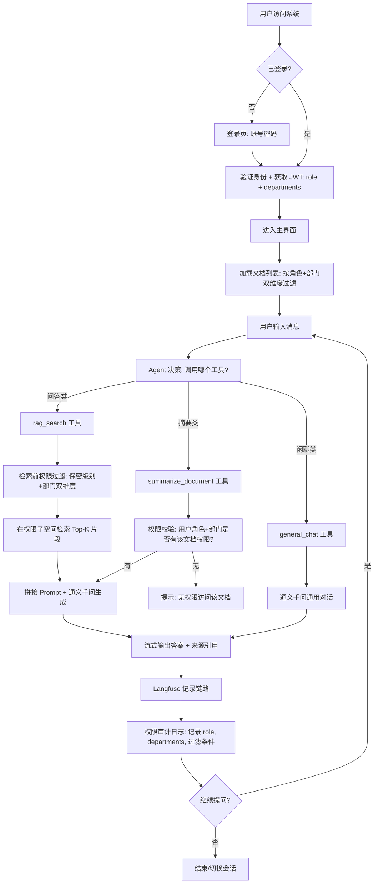

# 智能文档助手 PRD — 增量补充文档（v2 · 已定稿）

> **文档状态：✅ PRD 已定稿** — 所有待确认问题已由用户确认，可交付架构师进行技术方案设计。
>
> **文档性质**：基于 `PRD.md` v1 的增量更新，记录业务场景明确化、权限控制、国内 AI 选型、Agent 架构倾向等重大变更。
> **生效说明**：本文件与 `PRD.md` 配合阅读，冲突处以本文件为准。

---

## 1. 变更摘要表

| 编号 | 变更项 | 原方案（v1） | 新方案（v2） | 变更原因 |
|------|--------|-------------|-------------|---------|
| C-01 | 产品定位 | 通用文档问答工具 | **金融公司新人入职知识库** | 业务场景明确，聚焦企业内部文档问答 |
| C-02 | 目标用户 | 个人知识工作者 | 公司全体员工（尤其新入职员工） | 从 C 端工具转向 B 端企业应用 |
| C-03 | 用户认证 | P2（MVP 不做） | **P0（MVP 必须）** | 企业级多人使用，需多用户数据隔离 |
| C-04 | 权限控制 | 无 | **新增 P0：保密分级(4级) + 用户角色(4类) + 部门归属 双维度交叉权限过滤** | 金融公司合规硬需求 |
| C-05 | LLM 选型 | OpenAI GPT-4o-mini | **通义千问 Qwen 系列（国内模型）** | 数据不出境、国内访问稳定 |
| C-06 | Embedding | OpenAI text-embedding-3-small | **通义千问 Embedding** | 同上，国产化要求 |
| C-07 | 可观测追踪 | LangSmith | **Langfuse（开源自部署）或自建日志** | LangSmith 国内访问不稳定 |
| C-08 | 架构模式 | 固定流程 Chain（条件路由分派） | **倾向 Agent 架构**（LangChain createAgent） | 便于未来扩展新工具（查通讯录、提交工单等） |
| C-09 | 部署形态 | 本地开发优先 | **企业内网部署**（Docker Compose） | 金融数据需在内网环境处理 |
| C-10 | 数据隐私 | 可发 OpenAI | **数据不出内网**（国内模型 + 自部署组件） | 金融合规要求 |

---

## 2. 权限控制系统需求（★ 核心新增）

> ⚠️ 这是本次变更最重要的部分。权限控制是金融场景的合规底线，必须在架构层面设计，而非事后修补。

### 2.1 文档保密分级机制

文档在上传时必须标注保密级别，保密级别作为元数据随文档全生命周期（存储、向量化、检索、展示）流转。**L2/L3 级别带有部门归属维度**，形成保密级别 + 部门的双维度权限模型。

**分级体系（4 级）：**

| 级别 | 名称 | 访问规则 | 典型文档 |
|------|------|---------|---------|
| L1 | 全员公开 | 所有员工可见，不分部门 | 公司规章制度、福利制度、员工守则、通用技术规范 |
| L2 | 部门内部 | **仅同部门成员**可见 | 前端周会文档（仅前端部门可见）、财务部门内部文档 |
| L3 | 保密 | **本部门**主管/负责人可见 | 电脑管理员账号密码、部门敏感信息 |
| L4 | 机密 | CEO/高管可见（跨部门） | 高管薪酬、并购计划 |

> ⚠️ **关键区别（与线性模型的不同）：** L2 不是"全体正式员工可见"，而是增加了**部门维度**——前端部门的人能看前端的 L2 文档，但看不到财务部门的 L2 文档。L3 同理，部门主管只能看**本部门**的 L3，不能看其他部门的 L3。L4 为跨部门高管可见。

**机制要点：**
- 上传文档时，上传人**必须选择**保密级别（必填，不可默认）
- **L2/L3 文档上传时还必须标注所属部门**（必填）
- L1 文档无需标注部门（全员可见）；L4 文档无需标注部门（高管跨部门可见）
- 保密级别 + 部门归属存储在文档元数据中
- 向量化时，每个 chunk 的 metadata 携带 `security_level` 和 `department` 字段
- 文档列表展示时，用户只能看到自己有权限访问的文档
- 管理员可调整已上传文档的保密级别/部门归属（调整后需重新索引）

### 2.2 用户角色体系（角色 + 部门归属）

权限由**角色**和**部门归属**两个维度共同决定。用户角色决定可访问的保密级别范围，部门归属决定 L2/L3 文档的可见范围。

> ⚠️ **用户可属于多个部门**：用户的 `departments` 为数组（`string[]`）。普通员工通常只属于 1 个部门；CEO/高管可能同时属于多个部门（如同时属于投资部、信息技术部、品牌部）。

**角色体系（4 类）：**

| 角色 | 可见范围 | 说明 |
|------|---------|------|
| 普通员工 | L1（全员）+ L2（**所属部门**） | 可看全员公开文档 + 所属部门内部文档 |
| 部门主管/负责人 | L1（全员）+ L2（**所属部门**）+ L3（**所属部门**） | 在普通员工基础上增加所属部门保密文档 |
| CEO/高管 | L1（全员）+ L2（**所有部门**）+ L3（**所有部门**）+ L4 | 跨部门可见全部 L1-L4 文档 |
| 管理员 | 全部 + 管理权限 | 系统管理：上传/删除文档、分配角色、管理用户 |

**角色 × 部门 权限矩阵：**

|  | L1 全员公开 | L2 部门内部 | L3 保密 | L4 机密 |
|--|------------|------------|--------|--------|
| 普通员工 | ✅ 全部 | ✅ **仅所属部门** | ❌ | ❌ |
| 部门主管 | ✅ 全部 | ✅ **仅所属部门** | ✅ **仅所属部门** | ❌ |
| CEO/高管 | ✅ 全部 | ✅ **所有部门** | ✅ **所有部门** | ✅ 全部 |
| 管理员 | ✅ 全部 | ✅ 全部 | ✅ 全部 | ✅ 全部 |

**机制要点：**
- 用户登录后，JWT/Session 中携带 `role`（角色）和 `departments`（部门归属数组 `string[]`）
- `role` + `departments` 共同作为检索过滤的核心参数
- 普通员工/部门主管的 `departments` 通常只有 1 个元素；CEO/高管可能有多个
- CEO/高管的 L2/L3 可见范围为"所有部门"，因此 `departments` 数组对 CEO 不构成限制（L4 权限覆盖全部）
- 角色和部门由管理员维护（MVP 阶段手动分配，未来对接 HR 系统）

**公司部门列表（MVP 5 个，后续可扩展）：**

| 序号 | 部门名称 | 说明 |
|------|---------|------|
| 1 | 投资部 | - |
| 2 | 品牌部 | - |
| 3 | 信息技术部 | 包含前端和后端 |
| 4 | 人力资源部 | - |
| 5 | 财务部 | - |

### 2.3 RAG 检索权限过滤策略（★ 关键技术决策）

这是权限控制落地的核心环节。有两种过滤策略，**必须选择检索前过滤**。

#### 策略对比

| 维度 | 检索前过滤（Pre-filtering）✅ 推荐 | 检索后过滤（Post-filtering）❌ 不推荐 |
|------|--------------------------------|----------------------------------|
| **原理** | 向量检索时，通过 metadata where 条件限定只搜索用户有权限的文档子集 | 先全库检索 Top-K，再剔除无权限结果 |
| **安全性** | ✅ 系统从不接触无权限内容，零泄露风险 | ❌ 系统检索过程接触了保密内容，存在理论泄露风险 |
| **结果质量** | ✅ 在有权限范围内检索最优结果 | ❌ 剔除后可能剩余结果不足，甚至为空 |
| **实现难度** | ⚠️ 需向量库支持 metadata 过滤（Chroma/Milvus 等均支持） | ✅ 实现简单 |
| **金融合规** | ✅ 符合最小权限原则 | ❌ 不符合合规审计要求 |

#### 推荐方案：检索前过滤（双维度）

检索时需同时判断两个条件：
1. **保密级别**是否在用户角色允许范围内
2. 如果是 L2/L3，还要判断**部门**是否匹配

```
用户提问 → 获取用户 role + departments[]
         → 根据角色构建 metadata 过滤条件:

普通员工 → 可检索: (security_level == L1)
                    OR (security_level == L2 AND department IN user.departments)

部门主管 → 可检索: (security_level == L1)
                    OR (security_level ∈ [L2, L3] AND department IN user.departments)

CEO/高管 → 可检索: security_level ∈ [L1, L2, L3, L4]（所有部门，无部门限制）

管理员   → 可检索: 全部（无限制）

         → 向量库在过滤后的子空间中检索 Top-K
         → 仅返回有权限的文档片段
         → 拼接 Prompt → LLM 生成答案
```

> 📌 **多部门说明**：普通员工/部门主管的 `departments` 数组通常只有 1 个元素，过滤等价于精确匹配；CEO/高管的 L2/L3 权限为"所有部门"，不受 `departments` 限制。但 CEO/高管也可能通过 `departments` 数组明确管辖范围——架构师可自行决定 CEO 角色是否走数组过滤或直接放行全部部门。

**实现要点：**
1. 文档 chunk 入库时，metadata 必须包含：`{ doc_id, security_level, department, page, chunk_index }`
   - L1 文档：`department` 字段可留空或设为 `"all"`（全员可见）
   - L2/L3 文档：`department` 字段必须填写具体部门
   - L4 文档：`department` 字段可留空或设为 `"all"`（高管跨部门可见）
2. 检索时，向量库 query 附加复合 `where` 条件（保密级别 + 部门组合过滤）
3. Chroma / Milvus / Weaviate 均原生支持 metadata 多字段组合过滤，无技术障碍
4. 权限过滤不仅作用于 RAG 检索，还作用于：文档列表展示、文档摘要生成、多文档问答的文档关联

#### 权限过滤影响范围（全局约束）

| 功能模块 | 权限约束 |
|---------|---------|
| 文档列表 | 仅展示用户角色+部门允许访问的文档 |
| RAG 问答 | 检索前过滤，仅搜索有权限的文档子空间（双维度过滤） |
| 文档摘要 | 仅可对有权限的文档生成摘要 |
| 多文档问答 | 仅可关联有权限的文档 |
| 会话历史 | 用户只能看到自己的会话 |
| 文档管理 | 仅管理员可上传/删除/调整保密级别与部门归属 |

### 2.4 权限相关用户故事

| 编号 | 用户故事 |
|------|---------|
| US-P1 | 作为新入职员工，我想登录后直接看到我有权限访问的入职文档（员工守则、福利制度等全员公开文档），这样我不必到处找人问。 |
| US-P2 | 作为前端部门的普通员工，当我提问时，系统只从我有权查看的文档中检索答案——能看全员公开文档和前端部门内部文档，但绝不会泄露财务部门内部文档或保密级文档，这样符合公司信息安全要求。 |
| US-P3 | 作为管理员，我想上传文档时标注保密级别（L1-L4），L2/L3 还需标注所属部门，这样不同角色和部门的员工只能看到该看的文档。 |
| US-P4 | 作为管理员，我想为用户分配角色（普通员工/部门主管/CEO高管/管理员）和所属部门，这样系统自动控制其可访问的文档范围。 |
| US-P5 | 作为前端部门的普通员工，当我搜索"周会纪要"时，系统只返回前端部门的 L2 周会文档，不会返回财务部门的 L2 周会文档，这样实现部门间的文档隔离。 |
| US-P6 | 作为前端部门主管，我能看到前端部门的 L3 保密文档（如部门管理员账号密码），但看不到财务部门的 L3 保密文档，这样部门间敏感信息互不可见。 |
| US-P7 | 作为 CEO，我想搜索时能跨部门查看所有 L2 内部文档和 L3 保密文档，这样我能全面掌握各部门情况。 |
| US-P8 | 作为合规审计人员，我想查看系统的权限过滤日志，确认每次检索都正确执行了保密级别+部门双维度过滤，这样能通过公司合规审计。 |

### 2.5 权限相关功能需求项（P0）

| 编号 | 功能模块 | 需求描述 | 优先级 | 验收标准 |
|------|---------|---------|--------|---------|
| F-P01 | 用户认证-登录 | 用户通过账号密码登录，获取 JWT | P0 | 未登录无法访问任何功能 |
| F-P02 | 用户角色与部门管理 | 管理员可为用户分配角色（普通员工/部门主管/CEO高管/管理员）和所属部门（支持多部门） | P0 | 角色与部门信息存储于用户档案，JWT 携带 role + departments[] |
| F-P03 | 文档保密标注 | 上传文档时必选保密级别（L1-L4）；L2/L3 还必选所属部门（单部门） | P0 | 不选保密级别（及 L2/L3 的部门）则无法上传 |
| F-P04 | 检索前权限过滤 | RAG 检索时按用户角色+部门（数组）双维度过滤文档子空间 | P0 | 普通员工检索结果绝不包含非所属部门 L2/L3 文档及任何 L3/L4 文档；部门主管检索结果绝不包含非所属部门 L3 文档 |
| F-P05 | 文档列表权限过滤 | 文档列表仅展示用户角色+部门（数组）允许访问的文档 | P0 | 信息技术部员工看不到财务部 L2 文档；普通员工看不到任何 L3/L4 文档 |
| F-P06 | 摘要权限控制 | 仅可对有权限的文档生成摘要 | P0 | 无权限文档无"生成摘要"按钮 |
| F-P07 | 会话数据隔离 | 用户只能查看自己的会话历史 | P0 | 用户 A 看不到用户 B 的会话 |
| F-P08 | 权限审计日志 | 记录每次检索的权限过滤参数与结果 | P0 | 日志含 user_id, role, departments[], 过滤条件(保密级别+部门), 检索结果数 |

---

## 3. 更新后的需求池

> 以下为在原 PRD 需求池基础上的**增量调整**。标注 `[新增]`、`[升级]`、`[变更]`、`[降级]`。

### 3.1 功能需求变更

| 编号 | 功能模块 | 需求描述 | 原优先级 | 新优先级 | 变更类型 | 说明 |
|------|---------|---------|---------|---------|---------|------|
| F-19 | 用户认证 | 支持登录系统，多用户数据隔离 | P2 | **P0** | 升级 | 企业级多人使用，认证必须 |
| F-P01 | 用户认证-登录 | 账号密码登录 + JWT | - | **P0** | 新增 | 见 2.5 |
| F-P02 | 用户角色与部门管理 | 管理员分配角色+部门(支持多部门) | - | **P0** | 新增 | 见 2.5 |
| F-P03 | 文档保密标注 | 上传时必选保密级别+部门(L2/L3) | - | **P0** | 新增 | 见 2.5 |
| F-P04 | 检索前权限过滤 | RAG 检索按角色+部门双维度过滤 | - | **P0** | 新增 | 核心安全需求 |
| F-P05 | 文档列表权限过滤 | 列表仅展示有权限文档 | - | **P0** | 新增 | |
| F-P06 | 摘要权限控制 | 仅可对有权限文档生成摘要 | - | **P0** | 新增 | |
| F-P07 | 会话数据隔离 | 用户只能查看自己会话 | - | **P0** | 新增 | |
| F-P08 | 权限审计日志 | 记录检索权限过滤日志 | - | **P0** | 新增 | 合规审计 |
| F-14 | 文档列表管理 | 查看已上传文档列表，支持删除 | P1 | **P0** | 升级 | 企业场景需文档生命周期管理 |
| F-16 | 对话历史持久化 | 对话记录持久化存储 | P1 | **P0** | 升级 | 多用户场景必须落库 |
| F-11 | 链路追踪 | 记录完整链路 | P0 | **P0** | 变更 | LangSmith → Langfuse 自部署 |
| F-04 | 智能问答 | RAG 检索 + LLM 生成 | P0 | P0 | 变更 | 增加权限过滤约束 |
| F-09 | 条件路由 | 意图分派 | P0 | P0 | 变更 | 倾向改为 Agent 架构实现 |
| F-21 | 管理后台 | 文档管理 + 用户管理 + 权限配置 | - | **P1** | 新增 | 管理员操作界面 |
| F-22 | 文档保密级别调整 | 管理员可调整文档保密级别 | - | **P1** | 新增 | 调整后需重新索引 |
| F-23 | Agent 工具扩展预留 | Agent 架构支持后续新增工具 | - | **P1** | 新增 | 查通讯录、提交工单等 |

### 3.2 更新后的 P0 需求全景（MVP 范围）

| 分类 | 编号 | 需求 |
|------|------|------|
| **认证与权限** | F-P01 | 用户登录 + JWT |
| | F-P02 | 用户角色与部门管理 |
| | F-P03 | 文档保密标注 |
| | F-P04 | 检索前权限过滤 |
| | F-P05 | 文档列表权限过滤 |
| | F-P06 | 摘要权限控制 |
| | F-P07 | 会话数据隔离 |
| | F-P08 | 权限审计日志 |
| **文档管理** | F-01 | 文档上传（PDF/TXT/MD，含保密标注） |
| | F-02 | 文档索引（含 security_level + department metadata） |
| | F-03 | 处理进度展示 |
| | F-14 | 文档列表 + 删除（含向量清理） |
| **智能问答** | F-04 | RAG 问答（含权限过滤） |
| | F-05 | 无答案处理 |
| | F-06 | 流式输出 |
| | F-07 | 全文摘要 |
| | F-08 | 多轮对话记忆 |
| | F-09 | 条件路由 / Agent 意图识别 |
| **会话** | F-10 | 会话管理（新建/列表/切换） |
| | F-16 | 对话历史持久化（MongoDB） |
| **可观测** | F-11 | Langfuse 链路追踪 |

> 📌 MVP P0 项从原来的 11 项增至 **19 项**，主要增量在权限控制（8 项）。

---

## 4. 更新后的用户故事

### 4.1 金融公司新人入职场景故事（新增）

| 编号 | 用户故事 |
|------|---------|
| US-F1 | 作为刚入职的新员工，我想登录系统后看到一个"新人入门"文档集（员工守则、福利制度、技术规范等），这样我能快速了解公司基本情况，不用到处问人。 |
| US-F2 | 作为新员工，我想问"公司的加班制度是怎样的？"并立刻得到基于制度文档的准确回答（附来源），这样我不必翻阅几十页 PDF 也不必打扰同事。 |
| US-F3 | 作为新员工，我想问"晋升需要满足什么条件？"系统从晋升制度文档中检索答案并流式输出，这样我第一天就能明确发展路径。 |
| US-F4 | 作为新员工，当我有连续追问（"那初级升中级需要几年？""需要什么考核？"）时，系统能记住上下文，这样我不必每次重复背景。 |
| US-F5 | 作为新员工，我想让系统帮我总结一份长篇技术规范的要点，这样我能在 10 分钟内掌握核心规范而非读完全文。 |
| US-F6 | 作为管理员，我想上传新的福利制度文档并标注为"L1 全员公开"，这样所有员工都能查到；而部门内部文档标注为"L2 部门内部"并选定部门，这样只有同部门员工可见。 |
| US-F7 | 作为部门主管，我想查看哪些文档被提问最多（热度统计），这样我能知道新员工的常见困惑点，针对性地优化文档。 |

### 4.2 权限场景故事（见 2.4 节 US-P1 ~ US-P8）

---

## 5. 技术选型变更

### 5.1 AI 模型全面国产化

| 层级 | 原方案（v1） | 新方案（v2） | 变更理由 |
|------|-------------|-------------|---------|
| LLM | OpenAI GPT-4o-mini | **通义千问 Qwen-Plus / Qwen-Max** | 国内访问稳定、数据不出境、中文优化、有免费额度 |
| Embedding | OpenAI text-embedding-3-small | **通义千问 text-embedding-v2 / v3** | 同上，与 LLM 同生态，调用统一 |

**通义千问选型建议：**

| 模型 | 用途 | 说明 |
|------|------|------|
| Qwen-Plus | 日常问答、摘要 | 性价比高，速度快，MVP 默认 |
| Qwen-Max | 复杂推理场景 | 质量更高，成本更高，可按需切换 |
| text-embedding-v3 | 文档向量化 | 通义最新嵌入模型，中文效果好 |

**架构建议：** 在代码中抽象 LLM/Embedding 接口（LangChain 的 model 抽象已支持），配置文件切换模型，不硬编码。

### 5.2 可观测追踪方案变更

| 维度 | 原方案 | 新方案 |
|------|--------|--------|
| 工具 | LangSmith（SaaS） | **Langfuse（开源自部署）** |
| 部署 | 云端 | 内网 Docker 自部署 |
| 访问 | 国内不稳定 | 内网稳定 |
| 功能 | 链路追踪、评估 | 链路追踪、评估、Prompt 管理（功能足够） |
| 成本 | 按量付费 | 自部署免费（服务器成本） |
| 集成 | LangChain 原生 | LangChain Callbacks 支持，接入简单 |

**💡 建议：采用 Langfuse 自部署。**

理由：
1. Langfuse 开源版功能覆盖 MVP 所需（trace 可视化、token 用量统计、Prompt 版本管理）
2. Docker 一键部署，内网访问稳定
3. LangChain.js 通过 `CallbackHandler` 集成 Langfuse，代码改动极小
4. 替代方案：若 Langfuse 部署有困难，可先用自建结构化日志（记录每次检索的 query/retrieved_chunks/prompt/response），P1 再接入 Langfuse

### 5.3 架构模式倾向：Agent 架构

| 维度 | 固定流程 Chain（v1） | Agent 架构（v2 倾向） |
|------|---------------------|---------------------|
| 灵活性 | ❌ 每种意图需硬编码路由 | ✅ Agent 自主决策调用工具 |
| 扩展性 | ❌ 新增功能需改路由逻辑 | ✅ 新增工具即新增能力，无需改主流程 |
| 适用场景 | 流程固定的场景 | 功能持续扩展的企业应用 |
| 复杂度 | ✅ 简单可控 | ⚠️ 需注意 Agent 决策稳定性 |

**倾向方案：使用 LangChain `createAgent` 创建 Agent**

**Agent 工具集规划：**

| 阶段 | 工具 | 说明 |
|------|------|------|
| MVP | `rag_search` | RAG 文档检索问答（含权限过滤） |
| MVP | `summarize_document` | 文档摘要生成 |
| MVP | `general_chat` | 通用闲聊兜底 |
| P1 | `query_contacts` | 查询公司通讯录 |
| P1 | `submit_ticket` | 提交 IT/HR 工单 |
| P2 | `search_knowledge_base` | 跨知识库搜索 |
| P2 | `schedule_meeting` | 预约会议 |

**💡 PRD 层面的建议：** 产品倾向 Agent 架构以支持后续扩展，但最终技术可行性由架构师评估决定。MVP 阶段 Agent 至少需要 `rag_search`、`summarize_document`、`general_chat` 三个工具。

### 5.4 更新后的技术栈汇总

| 层级 | 技术选型 | 说明 |
|------|---------|------|
| 前端 | Vue3 + TypeScript + VueUse + Tailwind CSS | 不变 |
| 后端 | NestJS + TypeScript | 不变 |
| AI 框架 | LangChain.js（createAgent） | 倾向 Agent 架构 |
| 向量库 | Chroma（开发）/ Milvus（生产） | 均支持 metadata 过滤，满足权限需求 |
| 文档数据库 | MongoDB | 存储文档元数据、用户、会话、权限 |
| LLM | **通义千问 Qwen-Plus / Qwen-Max** | 国产化变更 |
| Embedding | **通义千问 text-embedding-v3** | 国产化变更 |
| 可观测 | **Langfuse（自部署）** | 替代 LangSmith |
| 流式通信 | SSE | 不变 |
| 认证 | JWT | 新增 P0 |
| 部署 | Docker Compose（企业内网） | 升级为 P0 |

---

## 6. 问题确认记录（全部已确认 ✅）

> 所有待确认问题已由用户最终确认。以下为完整决策记录。

### 6.1 权限体系相关

| 编号 | 问题 | 状态 | 最终方案 | 说明 |
|------|------|------|---------|------|
| Q-P01 | 文档保密级别分几级？ | ✅ 已确认 | 4 级：全员公开(L1)/部门内部(L2)/保密(L3)/机密(L4) | L2/L3 带部门维度 |
| Q-P02 | 用户角色体系如何定义？ | ✅ 已确认 | 4 类角色：普通员工/部门主管/CEO高管/管理员 + 部门归属（支持多部门） | 角色+部门双维度交叉权限 |
| Q-P03 | 是否对接公司现有 SSO？ | ✅ 已确认 | MVP 不对接，自建账号密码认证；P1 对接公司 SSO | 公司有 SSO 但 MVP 先跑通 |
| Q-P04 | 权限过滤粒度：文档级 vs 段落级？ | ✅ 已确认 | 文档级（整文档一个 security_level + department） | 段落级权限过于复杂，MVP 不必要 |
| Q-P05 | 是否需要"文档可见但不可问答"的中间态？ | ✅ 已确认 | 不需要。可见即可问答，不可见则完全隐藏 | 简化权限模型，降低复杂度 |
| Q-P06 | 管理员角色如何分配？ | ✅ 已确认 | MVP 预设 1 个管理员账号，手动指定 | 避免复杂的角色权限管理 |
| Q-P07 | 权限审计日志保留多久？ | ✅ 已确认 | 90 天 | 金融合规通常要求 3-6 个月 |
| Q-P08 | 公司有哪些部门？部门列表是否固定？ | ✅ 已确认 | MVP 5 个部门：投资部、品牌部、信息技术部（含前后端）、人力资源部、财务部 | 后续可扩展 |
| Q-P09 | L2/L3 文档是否支持多部门归属？ | ✅ 已确认 | 不支持，一篇文档只属于一个部门 | 简化模型；如需共享可复制文档 |
| Q-P10 | 一个用户是否只属于一个部门？ | ✅ 已确认 | **支持多部门**（`departments: string[]`）。普通员工通常 1 个；CEO/高管可能多个 | 与原建议不同，已按用户实际调整 |

### 6.2 企业场景相关

| 编号 | 问题 | 状态 | 最终方案 | 说明 |
|------|------|------|---------|------|
| Q-E01 | 预期用户规模？ | ✅ 已确认 | 约 100 人 | 影响部署架构与向量库选型 |
| Q-E02 | 文档由谁上传维护？ | ✅ 已确认 | 管理员统一上传维护 | 保证文档质量与保密标注准确 |
| Q-E03 | 是否需要文档分类（按部门/主题）？ | ✅ 已确认 | P1 增加分类标签 | MVP 先按保密级别+部门过滤 |
| Q-E04 | 是否需要问答热度统计？ | ✅ 已确认 | P1 增加 | 帮助管理员了解新员工常见困惑 |
| Q-E05 | 通义千问 API Key？ | ✅ 已确认 | 用户后续提供阿里云 DashScope API Key | 通义千问通过 DashScope 调用 |

---

## 7. 更新后的核心用户流程图（含权限控制）



---

## 8. 对架构师的关键提示

> 以下信息供架构师在设计技术方案时重点关注。

1. **权限过滤是架构级约束，不是功能补丁**：权限模型为**保密级别(4级) + 部门归属双维度交叉**，向量库选型必须支持 metadata **多字段组合过滤**（Chroma / Milvus / Weaviate 均支持）。检索层必须从设计之初就集成双维度权限过滤，不可后置。文档 chunk metadata 需包含 `security_level` 和 `department` 两个字段。

2. **Agent 架构 vs 固定 Chain**：产品倾向 `createAgent` 架构以支持未来扩展（查通讯录、提交工单等）。架构师需评估 LangChain.js createAgent 在 NestJS 中的可行性、Agent 决策稳定性、以及工具权限隔离（每个工具调用前需校验权限）。

3. **通义千问接入**：通过阿里云 DashScope API 调用，LangChain.js 有 `ChatTongyi` / `AlibabaTongyiEmbeddings` 集成。需确认 API 调用方式与速率限制。

4. **Langfuse 自部署**：需在 Docker Compose 中增加 Langfuse 服务（含 PostgreSQL）。LangChain.js 通过 `CallbackHandler` 集成。

5. **JWT 携带 role + departments[]**：每次 API 请求从 JWT 中解析用户角色和部门归属数组，作为双维度权限过滤参数传入检索层。权限过滤逻辑需根据角色动态构建复合 where 条件（保密级别 + `department IN departments` 组合）。注意 `departments` 为数组，普通员工通常 1 个元素，CEO/高管可能多个。

6. **企业内网部署**：所有组件（前端、后端、向量库、MongoDB、Langfuse）均需在内网环境运行，不依赖外部网络。用户规模约 100 人。

---

*本增量 PRD 由产品经理 Alice 基于 v1 PRD 更新。所有待确认问题已由用户最终确认，PRD 已定稿，可交付架构师进行技术方案设计。*
