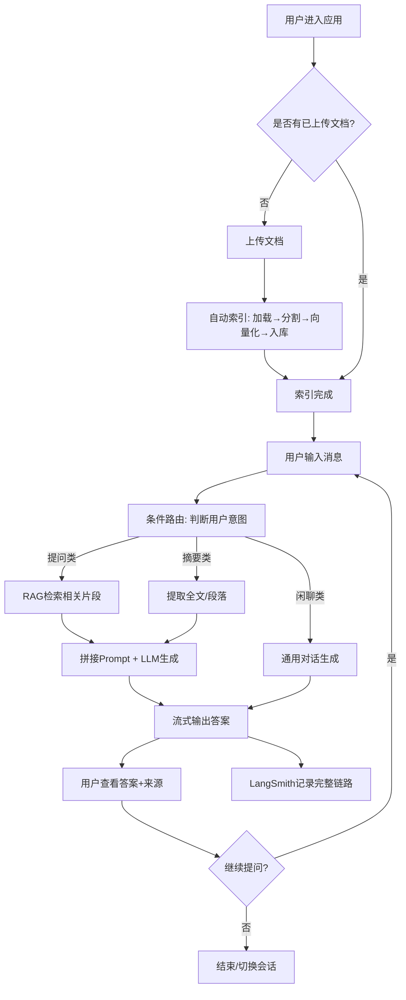

# 智能文档助手（Intelligent Document Assistant）PRD

## 项目信息

| 项目 | 内容 |
|------|------|
| **Language** | 中文 |
| **Programming Language** | 前端：Vue3 + TypeScript + VueUse；后端：待确认（见第 5 节） |
| **Project Name** | `intelligent_document_assistant` |
| **原始需求复述** | 构建一个智能文档助手，支持文档上传索引、RAG 智能问答、文档摘要、多轮对话、条件路由、流式输出与 LangSmith 可观测追踪，像一位专业文档顾问一样理解文档并回答问题。 |

---

## 1. 产品目标

### 1.1 要解决的问题

用户上传文档后，传统方式只能靠"Ctrl+F"关键词检索，无法理解文档语义、无法回答综合性问题、无法生成摘要。本产品旨在让用户能**用自然语言与文档对话**，像咨询一位读过全文的专业顾问一样，快速获得精准答案、摘要和多轮深入探讨。

### 1.2 目标用户

| 用户类型 | 画像 | 核心诉求 |
|---------|------|---------|
| 主用户 | 需要处理大量文档的知识工作者（学生、研究员、法务、产品经理等） | 快速理解文档、提问获得精准答案 |
| 次用户 | 团队协作场景下的文档共享者 | 多人复用同一文档知识库 |

### 1.3 产品目标（3 个正交目标）

| 编号 | 目标 | 成功标准（可衡量） |
|------|------|------------------|
| G1 | **精准问答**：用户基于上传文档提问，系统能检索相关片段并生成准确、可溯源的答案 | 答案准确率 ≥ 85%；答案附带来源引用率 100% |
| G2 | **流畅体验**：从上传到首字输出，全流程低延迟、流式可见 | 上传到可提问 < 30s（中等文档）；首字输出延迟 < 2s |
| G3 | **上下文连贯**：多轮对话中能记住前文，支持追问与澄清 | 连续 5 轮对话内上下文不丢失；用户追问满意度 ≥ 80% |

---

## 2. 用户故事

> 格式：As a [角色], I want [功能], so that [价值]

| 编号 | 对应核心功能 | 用户故事 |
|------|------------|---------|
| US-1 | 📄 文档上传与索引 | 作为知识工作者，我想上传 PDF/Word 文档并自动完成索引，这样我就能立即开始提问而不需手动预处理。 |
| US-2 | 📄 文档上传与索引 | 作为用户，我想看到文档处理进度（加载→分割→向量化→入库），这样我能知道系统是否正常工作以及还需等待多久。 |
| US-3 | 🔍 智能问答（RAG） | 作为研究员，我想用自然语言提问并获得基于文档内容的精准答案，并附带来源段落引用，这样我能信任并验证答案。 |
| US-4 | 🔍 智能问答（RAG） | 作为用户，当文档中没有相关信息时，我想得到"文档中未提及"的明确回复，而不是被编造的答案误导。 |
| US-5 | 📝 文档摘要 | 作为法务人员，我想一键生成一份长合同的全文摘要，这样我能在 1 分钟内掌握核心条款。 |
| US-6 | 📝 文档摘要 | 作为学生，我想对某个章节生成段落级摘要，这样我能针对性地理解重点。 |
| US-7 | 💬 多轮对话 | 作为用户，我想在追问时系统记住我上一个问题，这样我不必每次重复背景信息。 |
| US-8 | 💬 多轮对话 | 作为用户，当我的问题表述模糊时，系统能结合上下文理解我的真实意图。 |
| US-9 | 🔄 条件路由 | 作为用户，我想直接说"帮我总结这篇文档"，系统就自动执行摘要而非问答流程，这样我不需要手动选择模式。 |
| US-10 | ⚡ 流式输出 | 作为用户，我想看到答案逐字出现，这样我不必等待整段生成完毕，体验更流畅。 |
| US-11 | 📊 可观测追踪 | 作为开发者，我想在 LangSmith 中查看每次问答的完整链路（检索→拼 Prompt→生成），这样我能定位和优化性能瓶颈。 |

---

## 3. 需求池（P0/P1/P2 分级）

> **P0**：MVP 必须有（Minimum Viable Product）
> **P1**：第二阶段增强
> **P2**：未来可考虑

### 3.1 功能需求

| 编号 | 功能模块 | 需求描述 | 优先级 | 验收标准 |
|------|---------|---------|--------|---------|
| F-01 | 文档上传 | 支持上传单个文档（PDF/TXT/Markdown） | P0 | 上传成功后返回文档 ID，文件持久化存储 |
| F-02 | 文档索引 | 自动执行：加载→文本分割→向量化→存入向量库 | P0 | 全流程自动完成，4 个阶段状态可查 |
| F-03 | 处理进度 | 前端实时展示索引各阶段进度 | P0 | 用户可见"加载中/分割中/向量化中/已完成"状态 |
| F-04 | 智能问答 | 用户提问，RAG 检索相关片段+LLM 生成答案 | P0 | 答案附带来源片段引用 |
| F-05 | 无答案处理 | 文档无相关信息时，明确回复"未提及"，不编造 | P0 | 无关问题不产生幻觉答案 |
| F-06 | 流式输出 | 问答答案以 SSE 流式推送，逐字显示 | P0 | 首字延迟 < 2s，前端逐字渲染 |
| F-07 | 文档摘要-全文 | 一键生成全文摘要（默认粒度） | P0 | 摘要覆盖核心要点，长度适中 |
| F-08 | 多轮对话记忆 | 同一会话内保持上下文，支持追问 | P0 | 连续 5 轮对话上下文不丢失 |
| F-09 | 条件路由 | 根据用户意图自动分派到问答/摘要/闲聊流程 | P0 | "帮我总结"→摘要；提问→问答；闲聊→通用对话 |
| F-10 | 会话管理 | 创建新会话、查看历史会话列表 | P0 | 可新建会话，历史会话可重新打开 |
| F-11 | LangSmith 追踪 | 每次查询记录完整链路到 LangSmith | P0 | LangSmith 可见 trace，含检索/prompt/生成各步骤 |
| F-12 | 文档格式-Word | 支持 .docx 格式上传 | P1 | 正确提取 Word 文本内容 |
| F-13 | 文档摘要-段落级 | 支持指定段落/章节生成摘要 | P1 | 可选择目标段落生成局部摘要 |
| F-14 | 文档列表管理 | 查看已上传文档列表，支持删除 | P1 | 可查看列表、删除文档及其向量索引 |
| F-15 | 多文档问答 | 支持同时关联多个文档进行问答 | P1 | 跨文档检索并标注来源文档 |
| F-16 | 对话历史持久化 | 对话记录持久化存储，刷新不丢失 | P1 | 刷新页面后历史对话可恢复 |
| F-17 | 文档格式-Excel | 支持 .xlsx 格式上传 | P2 | 正确解析表格内容 |
| F-18 | 文档分类管理 | 支持文档分组/标签分类 | P2 | 可按分类筛选文档 |
| F-19 | 用户认证 | 支持登录系统，多用户数据隔离 | P2 | 不同用户文档/会话相互隔离 |
| F-20 | 闲聊兜底 | 无文档相关意图时进行通用闲聊 | P2 | 友好闲聊不报错 |

### 3.2 非功能需求

| 编号 | 需求描述 | 优先级 |
|------|---------|--------|
| NF-01 | 单文档大小限制：≤ 20MB（MVP） | P0 |
| NF-02 | 索引处理时间：中等文档（< 5MB）≤ 30s | P0 |
| NF-03 | 首字输出延迟 ≤ 2s | P0 |
| NF-04 | 支持中文与英文文档 | P0 |
| NF-05 | 通过 Docker 支持一键部署 | P1 |
| NF-06 | 接口错误友好提示，不暴露堆栈 | P0 |

---

## 4. UI / 交互设计稿描述

### 4.1 整体布局（三栏式）

```
┌─────────────┬──────────────────────────┬────────────────┐
│  左栏:会话列表 │     中栏:对话区域          │  右栏:文档区     │
│             │                          │                │
│ + 新建会话    │  ┌────────────────────┐  │  已上传文档列表   │
│             │  │ 系统欢迎语          │  │  ┌────────────┐ │
│ 会话1 (摘要)  │  │ 用户:帮我总结这篇…  │  │  │ report.pdf  │ │
│ 会话2 (问答)  │  │ 助手:这篇文档主要…  │  │  │ ✓ 已索引     │ │
│ 会话3 (追问)  │  │ [来源: 第3页]      │  │  └────────────┘ │
│             │  └────────────────────┘  │  ┌────────────┐ │
│             │                          │  │ + 上传文档   │ │
│             │  ┌────────────────────┐  │  └────────────┘ │
│             │  │ 输入框       [发送] │  │                │
│             │  └────────────────────┘  │                │
└─────────────┴──────────────────────────┴────────────────┘
```

### 4.2 核心页面与交互流程

#### 页面 A：主对话页（默认页）

**核心元素：**

- **左栏 - 会话列表**：顶部"+ 新建会话"按钮；下方列出历史会话（标题+时间），点击切换。每个会话可删除。
- **中栏 - 对话区域**：
  - 顶部：当前关联的文档标签（如"📄 report.pdf"）
  - 中部：聊天气泡式对话流，用户消息靠右，助手消息靠左。助手消息下方显示"📎 来源：第X页"可点击展开原文片段。
  - 助手消息支持**流式逐字渲染**，生成中显示打字光标。
  - 底部：输入框 + 发送按钮。输入框支持回车发送（Shift+Enter 换行）。
- **右栏 - 文档区**：
  - 已上传文档卡片列表（文件名 + 状态徽章：处理中/已索引/失败）
  - 处理中状态显示进度条和当前阶段
  - 底部"+ 上传文档"按钮（拖拽上传区）

**用户操作流程：**

1. 进入页面 → 右栏上传文档 → 看到"处理中"进度
2. 索引完成（状态变绿✓）→ 中栏输入框激活
3. 输入问题 → 回车发送 → 助手流式输出答案 + 来源引用
4. 继续追问 → 系统记住上下文 → 多轮对话

#### 页面 B：文档摘要入口

**触发方式：** 用户在输入框输入"帮我总结这篇文档"或在右栏文档卡片上点击"生成摘要"按钮。

**交互：**
- 系统识别摘要意图（条件路由）→ 流式输出全文摘要
- 摘要结果以卡片形式展示，支持"复制""重新生成"

#### 页面 C：空状态

- 首次进入，右栏无文档时显示引导："拖拽文档到此处开始，或点击上传"
- 中栏显示欢迎语："你好！我是你的智能文档助手，上传文档后即可开始提问。"

### 4.3 核心用户流程图



---

## 5. 待确认问题（CRITICAL）

> ⚠️ 这是用户当前最关心的部分。以下每个问题都附带了**产品经理的专业建议**和**理由**，帮助用户快速决策。

### 5.1 后端技术栈选择（Node.js vs Python）

| 维度 | 选项 A：Node.js + NestJS | 选项 B：Python（FastAPI） |
|------|------------------------|--------------------------|
| **用户熟悉度** | ✅ 已有经验（Vue3+TS+NestJS 生态统一） | ❌ 需从零学习 Python |
| **AI/LLM 生态** | ⚠️ LangChain.js 可用但功能略少于 Python 版 | ✅ LangChain Python 生态最完整，社区资源最多 |
| **学习成本** | ✅ 低，可快速上手 | ❌ 高，需学 Python 语法 + FastAPI + 虚拟环境管理 |
| **类型安全** | ✅ TypeScript 全栈类型一致 | ❌ Python 类型提示较弱 |
| **流式输出** | ✅ NestJS 支持 SSE | ✅ FastAPI StreamingResponse |
| **向量库支持** | ✅ 主流向量库均有 JS SDK | ✅ 原生支持更广 |
| **招聘/资料** | ⚠️ AI 方向 Python 资料更多 | ✅ AI 方向资料丰富 |

**💡 产品经理建议：选择选项 A（Node.js + NestJS + LangChain.js）**

**理由：**
1. **学习成本是最大约束**——用户是前端实习生，Python 从零学起会严重拖慢 MVP 进度。用已掌握的 NestJS 可以 2 周内出原型，Python 至少多花 2-3 周学习。
2. **LangChain.js 功能足够 MVP**——RAG、向量库、流式输出、记忆系统、LangSmith 追踪，LangChain.js 全部支持，不会成为瓶颈。
3. **全栈 TypeScript**——前后端类型共享，减少沟通成本，对个人项目尤其高效。
4. **何时考虑转 Python**——如果后续需要复杂的 Agent 编排、本地模型部署（vLLM）、或细粒度的 RAG 优化（如自定义 reranker），那时再引入 Python 微服务也不迟。MVP 阶段不必过度设计。

> **结论：MVP 用 NestJS 跑通全流程，未来按需引入 Python 微服务处理高级 AI 任务。**

---

### 5.2 支持的文档格式范围

| 格式 | MVP（P0） | 二期（P1） | 未来（P2） | 说明 |
|------|----------|-----------|-----------|------|
| PDF (.pdf) | ✅ | - | - | 最常见，LangChain PDFLoader 支持 |
| 纯文本 (.txt) | ✅ | - | - | 最简单，必支持 |
| Markdown (.md) | ✅ | - | - | 结构清晰，易处理 |
| Word (.docx) | - | ✅ | - | 用户可能常用，二期加 |
| Excel (.xlsx) | - | - | ✅ | 表格语义复杂，后期再考虑 |

**💡 建议：MVP 支持 PDF + TXT + Markdown 三种格式即可。** 这三种覆盖 80% 的文档场景，且 LangChain 均有成熟的 Loader。Word 二期通过 `docx` 库加入。

---

### 5.3 向量数据库选型

| 方案 | 优点 | 缺点 | 适合场景 |
|------|------|------|---------|
| **MongoDB Atlas Vector Search** | ✅ 复用已有 MongoDB，技术栈最简；✅ 运维成本低 | ⚠️ 需 Atlas 集群（M0 免费版有限制）；⚠️ 本地 MongoDB 不支持向量搜索 | 已用 MongoDB 且部署在 Atlas |
| **Chroma** | ✅ 本地开发极简；✅ 纯 Python/JS SDK 友好；✅ 免费 | ⚠️ 生产级扩展性较弱 | 本地开发/小型项目 |
| **Pinecone** | ✅ 全托管，免运维；✅ 性能好 | ❌ 付费（有免费额度但有限）；❌ 数据出境合规问题 | 快速上线、不差钱 |
| **Weaviate** | ✅ 功能丰富；✅ 可自托管 | ⚠️ 部署稍复杂 | 中大型项目 |
| **Milvus** | ✅ 高性能、可扩展 | ❌ 部署重，学习成本高 | 大规模生产 |

**💡 建议：开发期用 Chroma（本地零配置），生产部署考虑 MongoDB Atlas Vector Search（若用 Atlas）或继续 Chroma（Docker 部署）。**

**理由：**
- 用户已熟悉 MongoDB，但本地 MongoDB Community 不支持向量搜索（需 Atlas），所以开发期 Chroma 最省事。
- Chroma 可通过 Docker 一键部署，MVP 阶段性能完全够用。
- 如果后续上 MongoDB Atlas，可平滑迁移（LangChain 抽象了向量库接口）。

---

### 5.4 嵌入模型选择

| 方案 | 优点 | 缺点 | 成本 |
|------|------|------|------|
| **OpenAI text-embedding-3-small** | ✅ 质量好；✅ 多语言；✅ 调用简单 | ❌ 需 API Key + 网络；❌ 数据出境 | $0.02/百万token，极低 |
| **OpenAI text-embedding-3-large** | ✅ 质量更高 | 同上 | $0.13/百万token |
| **本地模型（如 bge-m3）** | ✅ 免费；✅ 数据不出境；✅ 中文优化 | ❌ 需 GPU/较高 CPU；❌ 部署复杂 | 硬件成本 |
| **通义千问 Embedding** | ✅ 中文效果好；✅ 国内访问稳定 | ⚠️ 需阿里云账号 | 有免费额度 |

**💡 建议：MVP 用 OpenAI text-embedding-3-small（质量/成本/易用性最佳平衡）。若数据合规要求高或国内访问受限，改用通义千问 Embedding。**

---

### 5.5 LLM 选择

| 方案 | 优点 | 缺点 | 成本 |
|------|------|------|------|
| **OpenAI GPT-4o-mini** | ✅ 性价比高；✅ 质量够用；✅ 速度快 | ❌ 国内需代理/中转 | ~$0.15/百万输入token |
| **OpenAI GPT-4o** | ✅ 质量最佳 | ❌ 贵；❌ 国内访问难 | ~$2.5/百万输入token |
| **Claude 3.5 Sonnet** | ✅ 长文本强；✅ 推理优秀 | ❌ 国内访问难 | ~$3/百万输入token |
| **通义千问 Qwen-Max** | ✅ 中文优秀；✅ 国内稳定；✅ 有免费额度 | ⚠️ 复杂推理略逊 GPT-4o | 有免费额度，付费较低 |
| **智谱 GLM-4** | ✅ 国内稳定；✅ 有免费额度 | ⚠️ 生态较小 | 有免费额度 |

**💡 建议：MVP 用 OpenAI GPT-4o-mini（通过 API 中转/代理解决国内访问）。若合规优先，选通义千问 Qwen-Max 或智谱 GLM-4。**

**理由：** GPT-4o-mini 对文档问答场景质量足够，成本极低，适合 MVP 验证。建议在配置中抽象 LLM 接口，方便后续切换。

---

### 5.6 用户认证需求

| 问题 | 建议 |
|------|------|
| MVP 是否需要登录？ | ❌ 不需要。MVP 定位为个人工具，无需登录即可使用，降低使用门槛。 |
| 多用户支持？ | P2 再考虑。MVP 单用户即可，所有文档/会话归属一个用户。 |
| 未来认证方案？ | P2 阶段加入 JWT 认证 + 用户注册登录，实现多用户数据隔离。 |

**💡 建议：MVP 不做认证，用本地存储/单用户模式。** 这样能 2 周内交付核心功能。认证是 P2 增强项。

---

### 5.7 部署方式

| 方案 | 建议 |
|------|------|
| 本地开发运行 | ✅ MVP 阶段，本地 `npm run dev` 即可 |
| Docker 部署 | ✅ P1 阶段，编写 Dockerfile + docker-compose（含向量库），一键部署 |
| 云部署 | P2 再考虑 |

**💡 建议：MVP 本地开发跑通，P1 提供 Docker Compose 一键部署（前端+后端+向量库三个容器）。**

---

### 5.8 文档大小与数量限制

| 维度 | MVP 建议 | 理由 |
|------|---------|------|
| 单文档大小 | ≤ 20MB | 平衡处理时间与内存，PDF 20MB 约几百页 |
| 文档数量 | ≤ 10 个 | MVP 个人使用足够 |
| 单次提问上下文 | 检索 Top 5 片段 | 控制_token_成本与相关性 |

**💡 建议：MVP 设定上述软限制，前端做校验提示，不阻塞但提醒用户。**

---

### 5.9 多语言支持

| 问题 | 建议 |
|------|------|
| 支持哪些语言？ | MVP 支持中文 + 英文（文档内容 + 对话交互） |
| 界面语言？ | 中文界面（用户为中文用户） |
| 未来扩展？ | P2 支持 i18n 国际化 |

**💡 建议：MVP 中文界面，文档内容支持中英文，嵌入模型选多语言模型（OpenAI/通义均支持）。**

---

### 5.10 文档管理功能

| 功能 | MVP（P0） | 二期（P1） |
|------|----------|-----------|
| 上传 | ✅ | - |
| 查看（是否已索引） | ✅ | - |
| 删除（含向量清理） | - | ✅ |
| 列表展示 | ✅ | - |
| 分类/标签 | - | P2 |

**💡 建议：MVP 支持上传+列表+状态查看，删除功能放 P1（需同步清理向量库索引，稍复杂）。**

---

### 5.11 对话历史持久化

| 方案 | 建议 |
|------|------|
| 存储介质 | MongoDB（复用已有技术栈） |
| 存储内容 | 会话 ID、消息列表（role + content + timestamp + 来源引用）、关联文档 ID |
| MVP 持久化？ | P1 实现。MVP 阶段可先内存存储（刷新丢失），P1 落库。 |

**💡 建议：MVP 内存存储快速验证，P1 落 MongoDB 持久化。** 会话数据结构设计时预留字段，便于平滑迁移。

---

### 5.12 多文档同时问答

| 问题 | 建议 |
|------|------|
| MVP 是否支持？ | ❌ P1 再做。MVP 单文档问答，流程简单，易验证。 |
| 实现方式 | P1 阶段支持关联多个文档，检索时跨文档搜索，答案标注来源文档。 |

**💡 建议：MVP 单文档问答优先跑通 RAG 全流程，多文档作为 P1 增强。**

---

### 5.13 待确认问题汇总表

| 编号 | 决策项 | 建议方案 | 优先级 |
|------|--------|---------|--------|
| Q-01 | 后端技术栈 | Node.js + NestJS + LangChain.js | P0 需立即决策 |
| Q-02 | 文档格式 | PDF + TXT + Markdown | P0 |
| Q-03 | 向量数据库 | 开发期 Chroma，生产可迁移 Atlas | P0 |
| Q-04 | 嵌入模型 | OpenAI text-embedding-3-small | P0 |
| Q-05 | LLM | OpenAI GPT-4o-mini（或通义千问 Qwen-Max） | P0 |
| Q-06 | 用户认证 | MVP 不做，P2 再加 | P2 |
| Q-07 | 部署方式 | MVP 本地，P1 Docker Compose | P1 |
| Q-08 | 文档限制 | ≤20MB / ≤10个 / Top5 检索 | P0 |
| Q-09 | 多语言 | 中文界面 + 中英文文档 | P0 |
| Q-10 | 文档管理 | 上传+列表+状态（MVP），删除（P1） | P0/P1 |
| Q-11 | 对话持久化 | MVP 内存，P1 落 MongoDB | P0/P1 |
| Q-12 | 多文档问答 | P1 增强 | P1 |

---

## 6. 技术栈建议汇总（基于以上决策）

| 层级 | 技术选型 | 说明 |
|------|---------|------|
| 前端 | Vue3 + TypeScript + VueUse + Tailwind CSS | 用户熟悉，快速开发 |
| 后端 | NestJS + TypeScript | 与前端类型统一 |
| AI 框架 | LangChain.js | RAG/记忆/路由/流式/追踪全覆盖 |
| 向量库 | Chroma（开发）/ MongoDB Atlas Vector Search（生产） | 开发零配置，生产可迁移 |
| 文档数据库 | MongoDB | 存储文档元数据 + 会话历史 |
| 嵌入模型 | OpenAI text-embedding-3-small | 性价比最优 |
| LLM | OpenAI GPT-4o-mini | MVP 质量与成本平衡 |
| 可观测 | LangSmith | 链路追踪与调试 |
| 流式通信 | SSE（Server-Sent Events） | NestJS 原生支持，前端简单对接 |

---

## 7. 开放问题（需用户进一步确认）

1. **OpenAI API 访问方式**：用户是否有 OpenAI API Key？国内是否需要通过中转服务访问？是否接受使用国产模型替代？
2. **LangSmith 账号**：用户是否已注册 LangSmith？是否需要替代方案（如本地日志追踪）？
3. **文档来源**：用户主要会上传什么类型的文档？（学术论文/合同/技术文档/小说？）——影响摘要策略和分块参数。
4. **并发预期**：MVP 是否只有自己使用？还是会有小团队同时使用？——影响是否需要队列处理。
5. **数据隐私**：上传的文档是否包含敏感信息？是否可以发送到 OpenAI？——影响模型选型。

---

*本 PRD 由产品经理 Alice 撰写，待用户确认第 5 节待确认问题后，将进入技术架构设计阶段。*
